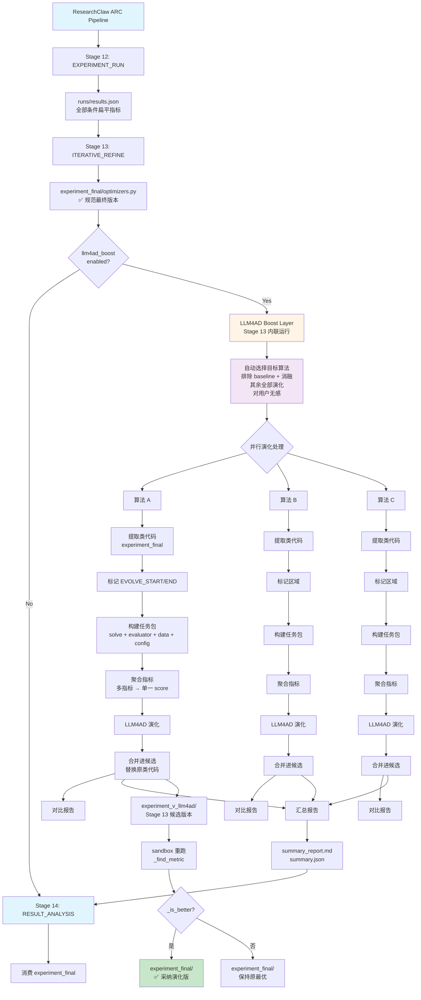
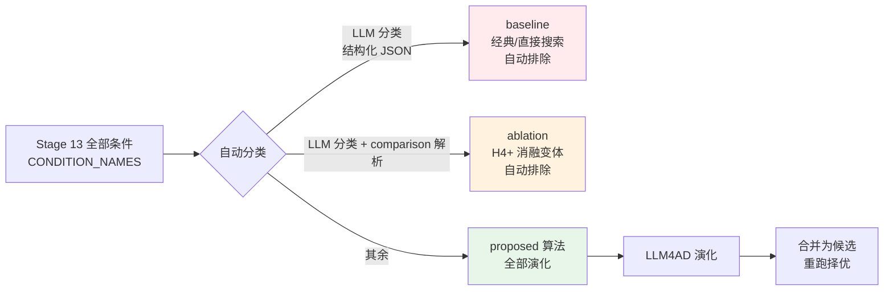
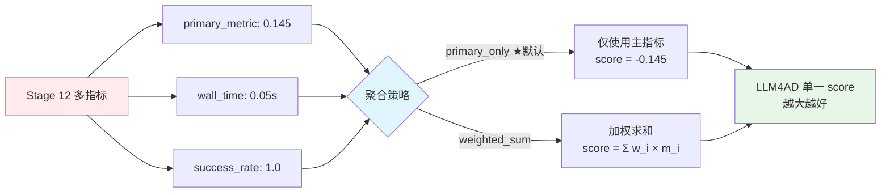
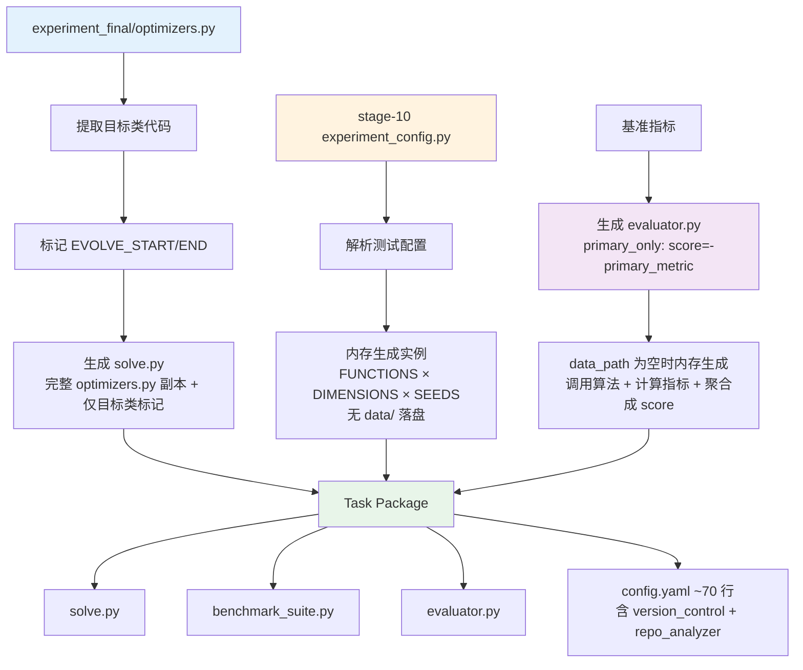

# LLM4AD 集成方案 — Stage 13 后置增强

## 文档版本
- **版本**: v3.5（✅ 最终实现方案 — Q1-Q5 + 3 点修正 + generation-0 修复 + 任务包路径绝对化全部定案）
- **日期**: 2026-08-21
- **状态**: ✅ **实现完成** — §5.2 清单 12 项全部落地（算法提取 LLM 三路分类 / 零文件 dataset / 完整模块 solve.py / config.yaml 内置 version_control+repo_analyzer（generation-0 硬依赖）/ Coder prompt 模板 v3.3（真实演化方法名 + EVOLVE 完整方法定义）/ 候选合并与公式修正 / 死配置项清理）；端到端测试见 `test_llm4ad_boost.py <run_dir>`

> 本文档与 `researchclaw/pipeline/llm4ad_utils/` 及 `researchclaw/pipeline/stage_impls/_llm4ad_boost.py` 的代码实现保持同步。
> 任何代码修改必须同步更新本文档，反之亦然。
> 同步基线：commit `cc5a09e`（fix: 完善llm4ad集成）之后的设计迭代。
> 已确认决策：Q1 消融不演化（**LLM 三路分类** + 启发式回退）/ Q2 保持后置内联 / Q3 简化输入（**删 data/，零文件 dataset 内存生成**，配置内置化）/ Q4 coder 用 **LLM4AD 内置 `custom`**（纯 prompt，无 CLI、无自研 provider）/ Q5 Stage 13 逻辑已输出 / **Q3' LLM4AD 演化用 primary_only（evaluator 返回 -primary_metric），improvement_pct 公式修正**。
> **v3.3 新增**：generation-0 运行链修复（config.yaml 必须写出 `version_control.local_path`（指向 task_package）+ `repo_analyzer`（evolve_detector），否则 init_sampler 抛 ValueError）；Coder prompt 模板注入真实被演化方法名（继承式类为 `_update_covariance`），EVOLVE 块含完整方法定义。
> **v3.4 新增**：`build_task_package` 构建前 `rmtree` 清空旧 task_dir —— 防止旧构建残留（如旧版 config.yaml 的 local_path 指向空目录 `abc/`）被覆盖后继续存活，导致 repo 分析 0 个 evolvable block、generation-0 全跳。
> **v3.5 新增**：`task_dir = task_dir.resolve()` 统一绝对路径 —— config.yaml 写入绝对 local_path/base_dir，规避 LLM4AD"相对 config.yaml 目录"拼接语义（llm4ad.py:84-87/270-273）下相对 task_dir 被二次拼接成 `<task_package>/<相对路径>` 双重嵌套（真实流水线 boost_dir 为相对路径，必踩；探针传绝对路径故未暴露）。

---

## 1. 执行摘要

### 1.1 集成目标
将 **LLM4AD**（Large Language Model for Algorithm Discovery）作为 **Stage 13 内联增强层**集成到 ResearchClaw 的 ARC-Bench 流水线中：Stage 13（ITERATIVE_REFINE）迭代择优结束后、`experiment_final/` 落盘之前，对**所有 Proposed 算法**（自动排除 Baseline 与消融实验）进行演化优化，演化产物作为**一个普通候选版本**回到 Stage 13 的择优循环——重跑实验、按 ARC 自己的真实指标与当前最优比较，胜出才进入 `experiment_final/`。同时保留 `stage-13/llm4ad_boost/` 下的完整对比数据用于论文写作。

### 1.2 核心价值
- **性能提升**: 在已有算法基础上进一步优化，突破人工设计的局限
- **多算法对比**: 自动演化所有 proposed 算法，提供丰富的对比数据用于论文写作
- **自动化**: 目标选择对用户无感，无需手动指定要演化的算法
- **默认关闭、失败降级**: `enabled: false` 时对 23 阶段流程零影响；启用后任何环节失败都退回 Stage 13 原有最优，不中断流水线
- **代码与数字同源**: 演化产物必须通过 ARC 的真实重跑才会被采纳，因此 `experiment_final/` 里的代码和论文里的指标始终来自同一次运行

### 1.3 关键指标
- **目标性能提升**: 5-20% (取决于问题复杂度)
- **演化算法数**: 自动 = proposed 算法数（排除 baseline + 消融），通常 2-8 个
- **时间预算**: 30 分钟/算法（可配置）
- **成功率**: >80% (能够产出可运行的优化算法)

---

## 2. 当前架构分析

### 2.1 ML03 实验流程（以 `artifacts/ab-rc_full-ML03-fix-ds-1/` 为例）

```
Stage 10: CODE_GENERATION     → 生成优化器代码
          └── experiment/optimizers.py
              ├── NelderMeadOptimizer          (baseline: 直接搜索)
              ├── PowellOptimizer              (baseline: 方向集)
              ├── CMAESDefaultOptimizer        (proposed 主算法)
              ├── CMAESIPOPRestartBaseline     (proposed: IPOP 重启变体)
              ├── CMAESDiagonalOnlyOptimizer   (消融: 对角协方差)
              └── CMAESFixedCovarianceOptimizer (消融: 固定协方差)

Stage 12: EXPERIMENT_RUN      → 运行所有条件（一个 run 包含所有条件）
          └── runs/results.json     {source, metrics: {condition/function_dim/seed/metric: value, ...}}
          └── runs/run-1.json       {run_id, task_id, status, metrics: {...同上}, elapsed_sec, ...}

Stage 13: ITERATIVE_REFINE    → 迭代优化算法
          ├── experiment_final/optimizers.py   (✅ 规范最终版本，Stage 14+ 消费此目录)
          ├── experiment_v1/, experiment_v2/   (中间迭代版本，仅参考)
          ├── refinement_log.json              (best_version / final_version 记录)
          └── llm4ad_boost/                    (✅ LLM4AD boost 产物，若启用)
```

### 2.2 关键事实（代码与产物验证结论）

**产物目录约定**：
- Stage 13 的规范最终产物是 **`experiment_final/`**（`_execution.py:1420` 写入，`refinement_log.json` 中 `final_version: "experiment_final/"`）。
- `experiment_v1/` / `experiment_v2/` 是中间迭代版本，**不应**作为 boost 的输入来源。
- Stage 13 运行结束后，`_execution.py` 内联调用 `run_llm4ad_boost_inline`（见 §4.5），产物写入 `stage-13/llm4ad_boost/`。

**Stage 12 结果文件格式（扁平 metrics，一个 run 多条件）**：
- `runs/results.json`（优先级最高）：
  ```json
  {
    "source": "stdout_parsed",
    "metrics": {
      "cma_es_default/rastrigin_2d/0/primary_metric": 4.97479,
      "cma_es_default/rastrigin_2d/primary_metric": 1.39217,      // 单元格均值
      "cma_es_default/rastrigin_2d/primary_metric_mean": 1.39217,
      "cma_es_default/rastrigin_2d/primary_metric_std": 1.49337,
      "cma_es_default/rastrigin_2d/median_wall_clock_runtime_seconds": 0.062,
      "cma_es_default/rastrigin_2d/completion_success_rate": 1.0,
      ...
    }
  }
  ```
- `runs/run-*.json`（回退）：
  ```json
  {
    "run_id": "run-1",
    "task_id": "sandbox-main",
    "status": "completed",
    "metrics": { /* 与 results.json 的 metrics 相同结构 */ },
    "elapsed_sec": 0.0, "stdout": "...", "stderr": "..."
  }
  ```
- 键模式：`<condition>/<function>_<dim>d/<metric>`（单元格均值/汇总，如 `primary_metric`），`<condition>/<function>_<dim>d/<seed>/<metric>`（单种子），`<condition>/<function>_<dim>d/<metric>_mean|_std`（聚合统计），无前缀键为全局汇总。
- **注意**：单个 run 文件包含**所有条件**的扁平 metrics 字典，不是"一个 run 一个条件"。

**条件分类（Baseline vs Proposed vs 消融）**：
- 权威条件来源：`experiment_final/experiment_config.py` 的 `Config.CONDITION_NAMES`。
- `experiment_final/main.py` 中 `get_optimizer_class()` 的 mapping 键即条件名，值是类名。
- 消融实验条件通过 main.py 的假设检验 comparison 列表引用（label 前缀 `H4_` 等，`condition_b` 为被比较的消融变体）——见 §3.2 的通用识别策略。
- **分类方法（v3.2 定案）：LLM 语义分类为主（结构化 JSON 三路输出），代码启发式仅为回退**（§3.2）。

**优化器代码结构**：
- `optimizers.py` 包含多个类：`BaseOptimizer`、`ScipyOptimizerBase`、各具体算法类。
- 每个条件类实现 `optimize(self, objective, x0)`，返回 dict：`{"best_x", "best_f", "n_evals", "wall_time", "success", "f_history", "eval_history"}`。
- **继承式 proposed 算法（v3.2 修复）**：条件类可能继承基类并只重写部分方法，`optimize` 来自继承。例：ML03 `CMAESDefaultOptimizer(CMAOptimizer)` 仅重写 `_update_covariance`（18 行），`optimize` 继承自 `CMAOptimizer`（578-766 行）。此时 `algorithm_info.code`（单类源码）无法独立运行，solve.py 必须是**完整 optimizers.py**（保留基类与继承链），仅用 `mark_class_in_module` 在目标类上打 EVOLVE 标记。
- 类名→条件名映射：去掉 `Optimizer`/`Baseline` 后缀 + 驼峰转下划线（`CMAESDefaultOptimizer → cma_es_default`；`CMAESIPOPRestartBaseline → cma_es_ipop_restart`）。**注意**：`Baseline` 后缀不是 baseline 条件标记，仅 IPOP 变体这样命名。

### 2.3 LLM4AD 输入要求分析

**必需文件结构（v3.2：无 data/ 目录）**：
```
task_package/
├── solve.py              # 待演化的算法（完整 optimizers.py 副本，仅目标类带 EVOLVE_START/END 标记）
├── evaluator.py          # 自定义评估器（继承 BaseEvaluator）
├── benchmark_suite.py    # 原始 benchmark 函数（复制自 stage-10/experiment/benchmark_functions.py）
├── experiment_config.py  # Stage 10 配置（benchmark_suite 的 get_search_domain 依赖）
└── config.yaml           # 精简 LLM4AD 配置（~70 行，含 version_control/repo_analyzer）
```

> **v3.2 简化**：`data/` 目录已删除。评估器在 `cfg.data_path` 为空（dispatcher 零文件路径 `mode: files` + `files: []`）时直接在内存中遍历 `FUNCTIONS × DIMENSIONS × SEEDS` 生成实例——无需修改 LLM4AD `DatasetConfig` schema（§3.4 详述）。

**solve.py 要求**：
- 包含 `# EVOLVE_START` 和 `# EVOLVE_END` 标记。
- 标记之间的代码会被 LLM4AD 演化；标记之外的辅助代码（基类、导入）保持不变。
- 目标类若定义自身 `optimize`：签名 `def optimize(self, objective, x0)`，返回固定格式 dict；**继承式 proposed 类**（只重写 `_update_covariance` 等内部方法）则 EVOLVE 块包裹该方法定义，签名/副作用须与基类调用者兼容（§3.4 关键实现点 1）。

**evaluator.py 要求**：
- 继承 `BaseEvaluator`，实现 `async def evaluate(cfg: EvalContext) -> EvaluationResult`。
- 返回 `EvaluationResult(score=float, metrics=dict, success=bool, ...)`。
- **关键**: `score` 是单一浮点数，作为 LLM4AD 的演化优化目标。**v3.2：score = `-primary_metric`**（minimize 取负转最大化，与 Stage 13 优化口径完全一致）。

### 2.3 Stage 13 现有优化逻辑（Q5 输出 — 基于什么指标优化）

**优化目标指标**：`experiment.metric_key`（默认 `primary_metric`），方向由 `metric_direction`（默认 minimize）决定。

**指标来源**（`_execution.py` `_execute_iterative_refine`）：
1. **baseline 指标**：读 `stage-12/runs/*.json`，每 run 用 `_find_metric(metrics, metric_key)` 模糊匹配（先精确键 → `_mean` 聚合键 → contains），**取所有 run 最优值**为 `baseline_metric`。
2. **每轮迭代**：LLM 改写代码 → sandbox 重跑 → 解析 stdout → `_find_metric` 取 `primary_metric`。
3. **比较**：`_is_better(metric_val, best_metric)`（minimize 取更小）。
4. **收敛**：`no_improve_streak >= 2` 停止；`consecutive_no_metrics >= 3` 中止；`max_iterations`（默认 4，上限 10）兜底。
5. **墙壁钟**：`_max_refine_wall_sec = per_iter_budget * 1.5`。
6. **特殊 hint**：条件覆盖缺口（stdout 无 `condition=` 标签）、指标饱和（相对变化率 < 0.1%）、BUG-58 PIVOT 回滚恢复、BUG-110 消融一致性。

```mermaid
flowchart TD
    Start[Stage 13 开始<br/>_execute_iterative_refine] --> Init[初始化]
    Init --> LoadBaseline[读 stage-12/runs/*.json<br/>_find_metric 取 baseline_metric<br/>取所有 run 最优值]
    LoadBaseline --> LoadCode[读 experiment_final/ 代码<br/>BUG-58: 优先恢复 PIVOT 周期最佳版本]
    LoadCode --> LoopStart{iteration 1..max_iterations<br/>max=min(config.max_iterations, 10)}

    LoopStart --> WallCheck{墙壁钟已超<br/>per_iter_budget*1.5?}
    WallCheck -->|是| StopWall[stop_reason=wall_clock_time_cap]
    WallCheck -->|否| Satur[指标饱和检测?<br/>相对变化率<0.1% → 注入难度升级 hint]
    Satur --> LLMImprove[LLM 改写代码<br/>iterative_improve prompt<br/>注入: 原始 exp_plan 锚点 + 条件覆盖 hint]
    LLMImprove --> Validate{validate_code<br/>语法检查}
    Validate -->|失败| LLMRepair[iterative_repair prompt 修复]
    LLMRepair --> Validate
    Validate -->|通过| Sandbox[创建 sandbox 重跑<br/>experiment_v{i} 写入]
    Sandbox --> ParseMetrics[解析 stdout metrics<br/>_find_metric(metric_key)<br/>超时则尝试 partial metrics]
    ParseMetrics --> AblationCheck[BUG-110 检查<br/>ABLATION_CHECK 行 → 输出是否相同]
    AblationCheck --> RuntimeCheck{运行时问题?<br/>NaN/Inf/stderr}
    RuntimeCheck -->|是| RuntimeRepair[iterative_repair prompt<br/>修复后重跑 sandbox2]
    RuntimeRepair --> Metric2[重新解析 metric_val]
    RuntimeCheck -->|否| MetricOK{Metric2}

    MetricOK --> Compare{_is_better<br/>metric_val vs best_metric?}
    Compare -->|更好| Update[best_metric=metric_val<br/>best_files=当前代码<br/>no_improve_streak=0<br/>iter_record.improved=true]
    Compare -->|无改进| Streak[no_improve_streak+=1]
    Metric2 -->|无指标| NoMetric[consecutive_no_metrics+=1]

    Update --> ConvergeCheck
    Streak --> ConvergeCheck
    NoMetric --> ConvergeCheck

    ConvergeCheck{收敛判定}
    ConvergeCheck -->|no_improve_streak >= 2| StopConverge[converged=true<br/>stop_reason=no_improvement_for_2_iterations]
    ConvergeCheck -->|consecutive_no_metrics >= 3| StopAbort[stop_reason=consecutive_no_metrics]
    ConvergeCheck -->|都不是| LoopNext[iteration+1 → LoopStart]

    LoopNext --> LoopStart
    StopConverge --> Final[写 experiment_final/<br/>best_files 最终版]
    StopAbort --> Final
    StopWall --> Final
    Final --> Boost{llm4ad_boost<br/>enabled?}
    Boost -->|是| LLM4AD[LLM4AD Boost 内联运行<br/>run_llm4ad_boost_inline]
    Boost -->|否| Stage14[Stage 14 消费<br/>experiment_final/]
    LLM4AD --> Stage14

    style Final fill:#c8e6c9
    style LLM4AD fill:#fff4e6
    style StopConverge fill:#ffe0b2
    style Stage14 fill:#e1f5ff
```

**与 LLM4AD 的关系（v3.2 定案：primary_only）**：Stage 13 只看单指标 `primary_metric`；LLM4AD boost 用 `primary_only` 聚合（`PrimaryOnlyAggregator`），evaluator 返回 `-primary_metric`（minimize 取负转最大化）作为单一 score —— **优化口径与 Stage 13 完全一致**，避免聚合逻辑改变演化目标。

---

## 3. 集成方案设计

### 3.1 集成架构 — Stage 13 内联后置增强



**设计要点**：
1. **目标选择对用户无感**：无 `target` 配置。代码通过 **LLM 三路分类**（baseline/ablation/proposed，结构化 JSON）自动识别并排除 baseline 与消融条件，其余 proposed 算法全部演化（§3.2）。
2. **合并而非回写**：演化后的最优代码替换掉候选文件集中对应的类（仅替换该类，保持其他类与导入不变），产出 `experiment_v_llm4ad/`。**不原地改任何已落盘文件**。是否采纳由 Stage 13 既有的 `_is_better(metric, best_metric)` 决定——判据是 ARC 的真实实验指标，而不是 LLM4AD 在其任务包 benchmark 上的代理分数（两个口径不必然一致）。
3. **内联运行**：Stage 13 择优结束后、`experiment_final/` 落盘前，在同一进程中调用 boost，产物写 `stage-13/llm4ad_boost/`，不创建独立 Stage，不影响 ARC 原有 23 阶段流程。
4. **模拟模式不采纳**：`experiment.mode` 非 `sandbox`/`docker` 时跑不出真实指标，此时只产报告不采纳候选——不验证就采纳等于把代理分数当成实验结果。

### 3.2 算法分类与自动选择

**核心原则**: **自动选择所有 proposed 算法（排除 baseline 与消融实验），对用户无感；LLM 语义分类为主，代码启发式仅为回退**



**分类流程（v3.2 定案：LLM 为主，启发式回退）**：

```
1. LLM 分类（主）:
   ┌──────────────────────────────────────────────────────────┐
   │ 输入: optimizers.py 全部类源码 + main.py 条件注册表         │
   │       (CONDITION_NAMES + get_optimizer_class 映射)        │
   │ Prompt: "将以下优化算法类分为三类:                        │
   │   baseline  = 经典/直接搜索基准算法(如 Nelder-Mead/Powell) │
   │   ablation  = 研究提出的变体但作为消融对照(被 H 检验引用)   │
   │   proposed  = 研究提出的创新算法                          │
   │ 输出 JSON: {"classifications": [...]}                     │
   └──────────────────────────────────────────────────────────┘
        ↓ 结构化 JSON（可审计，写入 boost_summary.json）
  2. 启发式回退（LLM 不可用/JSON 解析失败）:
     - 类继承 ScipyOptimizerBase 且条件名 ∈ {nelder_mead, powell,
       cobyla, slsqp, l_bfgs_b, ...} → baseline
     - main.py comparisons 中 H4+ label 的 condition_b → ablation
     - 其余 → proposed
```

**为什么用 LLM 分类（替代类名启发式）**：
- 类名启发式不通用：`ScipyOptimizerBase` 是 ML03 特定类名，换题目不保证出现；`CMAESIPOPRestartBaseline` 的 "Baseline" 后缀只是变体命名，会误判为 baseline。
- LLM 语义理解能正确区分"研究提出的创新算法"（proposed）与"对照用的经典方法"（baseline）及"变体消融"（ablation），输出结构化 JSON 可审计。
- 代码启发式保留为回退路径，保证 LLM 不可用时流程不中断。

**消融实验识别（辅助 LLM 分类的 comparison 证据）**：
- 从 `experiment_final/main.py` 解析假设检验 comparison 列表：
  ```python
  comparisons = [
      {"label": "H4_cma_es_default_vs_cma_es_diagonal_only",
       "condition_a": "cma_es_default",
       "condition_b": "cma_es_diagonal_only", ...},
      ...
  ]
  ```
- `condition_b`（被比较的变体）即消融条件；`condition_a` 为主算法。
- LLM 分类时将该 comparison 列表作为上下文证据注入，帮助判定 ablation；启发式回退时直接用 `H4+` label 前缀匹配。

**选择结果写入 `boost_summary.json`**（v3.2 新增，用户可审计）：
```json
{
  "classified": {
    "baseline": ["nelder_mead", "powell"],
    "ablation": ["cma_es_diagonal_only", "cma_es_fixed_covariance"],
    "proposed": ["cma_es_default", "cma_es_ipop_restart"]
  }
}
```

### 3.3 多指标聚合策略（v3.2：默认 primary_only）

**核心问题**：ResearchClaw 产生多个指标，但 LLM4AD 需要单一 score



**配置**（`config.arc.yaml` → `Llm4adBoostConfig.metric_aggregation`，由 `metric_aggregator.py` 消费）：

```yaml
llm4ad_boost:
  metric_aggregation:
    method: "primary_only"            # ★ v3.2 默认 primary_only（与 Stage 13 优化口径一致）
    # weights:                        # weighted_sum 时才需要
    #   primary_metric: 1.0
    #   wall_time: -0.2
    #   success_rate: 0.5
    normalization: "none"
```

**实现**（`metric_aggregator.py`）：
- `PrimaryOnlyAggregator`：`score = -primary_metric`（minimize 方向）或 `+primary_metric`（maximize 方向）。
- `WeightedSumAggregator`：逐指标归一化（zscore/minmax/none）后加权求和（保留为可选能力，论文需要多目标权衡时使用）。
- 实验级 `metric_key`/`metric_direction`（`config.experiment.metric_key`/`metric_direction`）作为 primary_only 的默认值，保证与 Stage 12 的评估口径一致。

**方向处理**：LLM4AD 的 `score` 一律约定为**越大越好**。minimize 方向指标通过负号或负权重转为最大化。

### 3.4 任务包构建策略（v3.3：无 data/，配置内置化，generation-0 段必须写出）

**核心原则**：
1. ✅ **保持算法接口不变** — 只提取算法类，输入输出格式不改
2. ✅ **复用原始测试配置** — 从 Stage 10 的 `experiment_config.py` 读取函数/维度/种子/预算，**在内存中**生成与 Stage 12 相同的测试实例（无 JSON 落盘）
3. ✅ **适配 LLM4AD 评估器** — 生成兼容评估器，内部调用原有算法逻辑



**任务包结构**（`task_builder.py` 构建，输出到 `boost_dir/<condition_name>/task_package/`；v3.4 起构建前 `rmtree` 清空旧 task_dir 防残留，v3.5 起 `task_dir.resolve()` 绝对化后写入 config.yaml）：

```
task_package/
├── solve.py                    # 完整 optimizers.py 副本（基类+继承链），仅目标类标记 EVOLVE_START/END
├── evaluator.py                # LLM4AD 适配评估器（data_path 为空 → 内存生成实例）
├── benchmark_suite.py          # 复制自 stage-10/experiment/benchmark_functions.py
├── experiment_config.py        # 复制自 stage-10/experiment/（benchmark_suite 的 get_search_domain 依赖）
└── config.yaml                 # 精简配置（~70 行，含 version_control/repo_analyzer，见下）
```

**通用化要求**（不针对特定实验硬编码）：
- 函数名/维度/种子/预算：从 Stage 10 的 `experiment_config.py` 解析（`FUNCTIONS`/`DIMENSIONS`/`SEEDS`/`EVALUATION_BUDGET`），解析失败才回退默认值。
- 类名/条件名：从 `optimizers.py` AST 解析 + `_class_name_to_condition` 转换，不写死。
- metric 名/方向：从全局 `experiment.metric_key`/`metric_direction` 与 `llm4ad_boost.metric_aggregation` 读取。
- 文件名：`optimizers.py`、`benchmark_functions.py`、`experiment_config.py`、`main.py` 为 Stage 10/13 固定命名（已验证为流水线约定，非特殊例子）。

**关键实现点**：

1. **solve.py 生成**（`task_builder.py:_generate_solve_py`）：
   - **完整模块**：直接采用 `experiment_final/optimizers.py` 全文（保留全部基类与继承链，绝不注入手写 BaseOptimizer —— 会与真实基类重复/冲突），保证 `from solve import {class_name}` 与继承的 `optimize` 可运行。
   - 用 `mark_class_in_module(full_source, class_name, strategy, out_method_name)` 仅在目标类上打 `# EVOLVE_START` / `# EVOLVE_END`；其余基类/类不变。
   - **标记策略（继承式 proposed 算法）**：方法块 fallback（类无自身 `optimize` 方法时，如 `CMAESDefaultOptimizer(CMAOptimizer)` 只重写 `_update_covariance`）→ 首个非 `__init__` 方法至类结束整段包进标记，**EVOLVE 块含完整方法定义（`def` 签名行 + body）**；方法体分支（类有自身 optimize）→ `def` 行之后到方法结束。
   - **out_method_name 回传**：真实被标记方法名（`optimize` 或 `_update_covariance`）经 list out-param 回传 → `_generate_llm4ad_config` 注入 Coder prompt 模板（v3.2 不再硬编码 optimize）。

2. **benchmark_suite.py**：从 `run_dir/stage-10/experiment/benchmark_functions.py` 复制原文件（保留 `create_benchmark_suite`、`evaluate`、`generate_initial_guess` 接口）。

3. **实例生成（v3.2：内存生成，删除 `_copy_test_data` 落盘逻辑）**：
   ```python
   # evaluator.py 内部（data_path 为空或 data/ 不存在时）：
   def _iter_instances():
       for func in FUNCTIONS:          # 来自 experiment_config.py
           for dim in DIMENSIONS:
               for seed in SEEDS:
                   yield {"function": func, "dimension": dim, "seed": seed}
   ```

4. **evaluator.py 生成**（`evaluator_generator.py`）：
   - `ARCOptimizerEvaluator(BaseEvaluator)`，注册名 `arc_optimizer_evaluator`。
   - `evaluate()` 流程：若 `cfg.data_path` 非空且存在 data 文件则读文件；**否则在内存中遍历 `FUNCTIONS × DIMENSIONS × SEEDS`** → 对每个实例 `create_benchmark_suite(dim, func)` + 构造优化器 + `optimizer.optimize(benchmark.evaluate, x0)` → 收集指标（`best_f`/`wall_time`/`success`/`n_evals`）→ 聚合（v3.2 默认 `primary_only`：score = -primary_metric）→ 返回单一 score。
   - `weighted_sum` 模式保留（内置归一化函数，与 `metric_aggregator.py` 逻辑一致）。
   - **不依赖 `cfg.project_root`**（dispatcher 传 `alg.worktree.path`，可能为空字符串）。

5. **config.yaml 生成（v3.2：~70 行精简，内置段按需写出）**：

```yaml
# task_package/config.yaml（由 task_builder 生成，v3.2 精简版 — 与当前实现一致）
providers:
  - name: "default"                    # ★ 内置 provider，直接连 config.arc.yaml 的 llm. 代理
    type: "openai_compatible"          # Q4：纯 prompt，无 CLI
    api_key: "<从 config.arc.yaml llm.api_key 读取>"   # 敏感，仅写入 task_package（用户可审计删除）
    base_url: "<从 config.arc.yaml llm.base_url 读取>"
    model: "<从 config.arc.yaml llm.primary_model 读取>"
    temperature: 0.7
    max_tokens: 8192
    timeout: <config.arc.yaml llm.timeout_sec>
coder:
  type: "custom"                       # ★ 纯 prompt EVOLVE 块替换（无 CLI、无 agent）
  provider: "default"
  temperature: 0.7
  max_gen_tokens: 4096
  context_max_tokens: 4096
  prompt_template: "<_generate_coder_prompt_template 生成的完整模板>"   # v3.2 注入真实演化方法名
planner:
  type: "llm_evolution"
  provider: "default"
  samplers: [{name: "init_sampler"}, {name: "mutation_sampler"}, {name: "crossover_sampler"}]
version_control:                       # ★ generation-0 必需（v3.3 新增写出）
  enabled: true
  type: "git_worktree"
  local_path: "<task_package 绝对路径>" #   llm4ad.py 依赖 local_path 才能做 repo 分析
                                       #   v3.5：task_dir 已 .resolve() 绝对化，local_path/base_dir
                                       #   写入绝对路径，规避相对 config.yaml 目录语义的二次拼接嵌套
  auto_initialize: true                #   不存在 git 仓库时 git init + 首次 commit（含全部 task 文件）
repo_analyzer:                         # ★ generation-0 必需（v3.3 新增写出）
  type: "evolve_detector"              #   扫描 solve.py 的 EVOLVE 标记 → evolvable_blocks
  context_lines_before: 5
  context_lines_after: 5
evaluator:
  type: "custom"
  module: "evaluator.py:ARCOptimizerEvaluator"
  timeout: <llm4ad_boost.resources.eval_timeout_sec>
  max_retries: 2
  parallel: true
  batch_size: <min(parallel_workers, 6)>
  dataset:
    mode: "files"                      # ★ 零文件路径 → dispatcher 对每算法调一次 evaluate(cfg)
    files: []                          #   data_path="" → 评估器内存生成实例
  metrics: ["primary_metric", "wall_time", "success"]
evolution:
  type: "island_ga"                    # 从 config.arc.yaml llm4ad_boost.evolution 读取
  max_generations: 20
  population_size: 10
  elite_ratio: 0.2
  mutation_rate: 0.6
  crossover_rate: 0.3
  island: {count: 4, migration_interval: 5, migration_rate: 0.1}
# workspace / logging / multimodal / memory：内置默认，不写出
```

> **generation-0 依赖链（v3.3 必须写出的原因）**：`version_control.local_path` 不写 → `repo_path=None` → `analyzed_repository=None` → `init_sampler.sample()` 抛 ValueError（`evolvable_blocks` 为空）。写出 `local_path` 指向 task_package 后：git_worktree 在 local_path 处 `auto_initialize`（git init + user.name=LLM4AD + 首次 commit 全部文件）→ `repo_analyzer`（evolve_detector）扫描 solve.py 的 EVOLVE 标记得到 `evolvable_blocks` → init_sampler 取 `evolvable_blocks[0]` 生成 Algorithm → 每次演化的独立 worktree 基于该 commit 创建（含 solve.py/evaluator.py/benchmark_suite.py/experiment_config.py，evaluator 从 worktree 的 config_dir 解析模块）。

6. **Coder prompt 模板（v3.3 重写，`_generate_coder_prompt_template`）**：
   - 模板必须含 `{insight}` 或 `{project_context}` 占位符（`.format()` 传 6 键：insight/language/task_description/constraints/project_context/file_name），否则 `custom_naive_coder._generate_initial` 忽略模板改用 planner 原始 prompt。
   - **所有 generation 都走 initial 全量重写**：planner `implement()` 从不传 parent_code → `_generate_initial` 对 mutation/crossover 同样生效 → 模板必须指导 LLM 输出**带 EVOLVE 标记的完整 solve.py**（fenced block 注解 ` ```python:solve.py``` `），否则后续无法变异。
   - 指令核心：EVOLVE 块内是**完整方法定义**（含 `def {method_name}(self, ...)` 签名行与 body，与 code_marker 方法块 fallback 的标记结构一致）；标记外（imports/类定义/基类/继承链/其他方法）必须原样复刻；`_update_covariance` 等内部方法保持签名/副作用与基类调用者兼容；`optimize` 返回 dict 键 `{"best_x", "best_f", "n_evals", "wall_time", "success"}`；改进方向（初始化/自适应参数/混合策略/重启/探索利用平衡）引导。
   - 方法名/类名以普通字符串拼接内联（模板非 f-string），规避 `.format()` 的 KeyError。

   - `_generate_llm4ad_config` 只写出会变的字段；`workspace`、`logging`、`multimodal`、`memory` 走 LLM4AD `AppConfig` 内置默认。**`version_control` 与 `repo_analyzer` 例外：必须写出**（generation-0 依赖链见上）。
   - evolution 块按 `evolution.method` 分派：`island_ga` 写岛屿子 dict（`island: {count, migration_interval, migration_rate}`），否则写标准 `population_size`。

### 3.5 算法提取（`algorithm_extractor.py`）

```python
def extract_proposed_algorithms(stage_dir: Path, run_dir: Path) -> list[AlgorithmInfo]:
    """从 Stage 13 提取所有 proposed 算法（自动排除 baseline 与消融）

    Returns:
        [
            AlgorithmInfo(
                condition_name="cma_es_default",
                class_name="CMAESDefaultOptimizer",
                file_path=experiment_final/optimizers.py,
                code="class CMAESDefaultOptimizer(...): ...",
                baseline_metrics={"primary_metric": 1.39, "wall_time": 0.062, ...},
                rank=1,
            ),
            ...
        ]
    """
```

**关键步骤（v3.2：LLM 分类）**：
1. `_find_latest_experiment_version(stage_dir)` → **只认 `experiment_final/`**（`experiment_v*` 是中间产物，不使用）。
2. 读取 `experiment_final/optimizers.py`。
3. `_load_stage12_results(stage12_dir)` → **优先 `runs/results.json`，回退 `runs/run-*.json`**，解析扁平 metrics 键。
4. `_parse_optimizer_classes(code)` → AST 提取全部类源码。
5. **LLM 三路分类**（§3.2）：注入类源码 + 条件注册表 + comparisons 证据，输出结构化 JSON（baseline/ablation/proposed）；LLM 不可用/解析失败时回退代码启发式。
6. 每个 proposed 类：`_class_name_to_condition` → 查 Stage 12 结果 → 组装 `AlgorithmInfo`。
7. 按主指标排序（rank 越小越好）。
8. 分类结果写入 `boost_summary.json`（`classified: {baseline, ablation, proposed}`）。

**Stage 12 扁平 metrics 解析**（`_parse_flat_metrics`）：
```python
KEY_RE = re.compile(
    r"^(?P<cond>[^/]+)/(?P<cell>[^/]+)/(?P<metric>[^/]+)$"
    # 例: cma_es_default/rastrigin_2d/primary_metric
)
```
- 遍历 `metrics` 字典的键。
- 匹配 `<cond>/<cell>/<metric>` 且 `<cell>` 不含 `/` → 单元格汇总指标（均值）。
- `<cond>/<cell>/<seed>/<metric>`（含数字种子段）→ 单种子指标，用于计算均值/std 的交叉验证。
- 聚合键 `<cond>/<cell>/<metric>_mean|_std` 直接吸收（`mean` 即单元格均值）。
- 每个条件取：`primary_metric`（条件级均值）、`median_wall_clock_runtime_seconds`、`completion_success_rate`，并统计所有单元格的 `primary_metric` 列表计算 `std/min/max`。
- `results.json` 与 `run-*.json` 结构相同（后者多 run_id/task_id/status 字段），解析逻辑复用；`results.json` 存在时优先使用。
- 条件级排序用 `primary_metric`（条件级均值）升序（minimize 方向）。

### 3.6 演化与候选合并（`_llm4ad_boost.py`）

**演化流程**（每算法独立）：
```python
def _run_llm4ad_evolution_single(algo, task_dir, boost_config) -> dict:
    # 1. 检查 llm4ad 已安装（ImportError → 明确报错提示 pip install llm4ad）
    # 2. LLM4AD(str(task_dir / "config.yaml"))
    # 3. llm4ad.print_run_summary(); result = asyncio.run(llm4ad.run())
    # 4. 提取 best_individual 的代码，写入 boost_dir/<condition>/evolved_solve.py
    # 5. 计算 improvement_pct（代理分数对比，仅用于报告）
    # 6. 返回 {status, best_generation, best_performance, baseline_performance,
    #         improvement_pct, evolved_code_path, used_baseline_fallback, evolution_log}
    # 本函数不写任何实验文件。
```

**演化代码提取优先级**（`_run_llm4ad_evolution_single`）：
1. LLM4AD workspace `generated/*.json` 中最新个体的 `code` 字段。
2. `best_individual.code` 属性。
3. 失败回退：原始 `solve.py`，标记 `used_baseline_fallback=True`（无可合并改动，跳过合并）。

**improvement_pct 公式**：
```python
# minimize 方向，正值 = 改进
improvement_pct = (baseline_raw - best_raw) / abs(baseline_raw) * 100
# baseline_raw = Stage 12 该条件 primary_metric（原始值，未取负）
# best_raw     = 演化 best_individual 的 primary_metric（原始值，未取负）
#
# baseline_raw 为 inf（指标缺失）或 0（除零）时记 None，不记 nan：
# nan 参与任何比较都为 False，会让下游判断静默走错分支。
#
# ⚠️ 该值是 LLM4AD 在其任务包 benchmark 上的**代理分数**，仅用于报告。
#    是否采纳由 Stage 13 的真实重跑决定，不看这个数。
```

**候选合并逻辑（`merge_evolved_into_files`）**：
```python
def merge_evolved_into_files(algo, evolved_code_path, files) -> tuple[dict | None, dict]:
    """把演化后的目标类并入一份候选文件集，返回新的 files dict（不落盘）

    规则：
    1. 用 AST 从 evolved 代码提取 algo.class_name 的完整类源码（含装饰器）。
       只扫 tree.body（模块顶层），不用 ast.walk——后者会匹配嵌套在函数/类
       内部的同名类，替换那种类会破坏外层结构。
       类区间取 min(ClassDef.lineno, 各装饰器 lineno)：ClassDef.lineno 指向
       `class` 关键字，直接用它提取时会丢 @dataclass，替换时会把旧装饰器留
       给新类体。
    2. 剥去 EVOLVE_START/END 标记行。
    3. 在 files 中查找顶层定义了该类的 .py 文件（不硬编码 optimizers.py）。
    4. 替换该类，AST 校验合并结果；失败则该算法整体跳过。
    5. 返回 (merged_files, info)；不修改入参 files，也不写盘。
    """
```

**合并与采纳时机**：`run_llm4ad_boost_inline` 步骤 6 把所有成功演化的算法逐个合并进 `best_files` 的副本，随汇总一并返回 `evolved_files`。Stage 13（`_execution.py`）随后：

```python
_write_project(stage_dir / "experiment_v_llm4ad", evolved_files)
boost_metric = _find_metric(sandbox.run_project(...).metrics, metric_key)
if boost_metric is not None and _is_better(boost_metric, best_metric):
    best_metric, best_files, best_version = boost_metric, dict(evolved_files), "experiment_v_llm4ad/"
_write_project(final_dir, best_files)          # 既有逻辑，未改动
```

因此不需要备份/回滚（从未原地改文件），也不需要 `improvement_pct > 0` 那道自制判据（复用 `_is_better`）。该候选在 `refinement_log.json` 的 `iterations` 里与其他迭代平级，另加 `llm4ad_boost` 段记录是否采纳。

**并行演化调度**：
```python
if boost_config.parallel_evolution:
    # 分批，每批 max_parallel_algorithms 个算法并行
    for batch in chunks(task_packages, max_parallel):
        batch_results = asyncio.run(_evolve_batch_parallel(batch, boost_config))
else:
    # 串行
    for algo, task_dir in task_packages:
        evolution_results[name] = _run_llm4ad_evolution_single(algo, task_dir, boost_config)
```

### 3.7 对比报告与汇总（`comparison_reporter.py`）

- `generate_comparison_report(algo, result, algo_dir)`：单算法，输出 `comparison.json` + `report.md`（baseline score / evolved score / improvement_pct / 演化代数 / 演化代码路径）。
- `generate_summary_report(algorithms, all_comparisons, boost_dir)`：汇总，输出 `summary.json` + `summary_report.md`（总算法数/成功/改进/失败/平均提升/每算法状态表）。
- 报告语言：中文为主，兼容论文表格。

---

## 4. 配置设计

### 4.1 完整配置示例（与 `config.arc.yaml` 当前实现一致）

```yaml
# config.arc.yaml (LLM4AD Boost 段)
experiment:
  mode: "sandbox"
  metric_key: "primary_metric"          # 实验主指标（聚合/排序默认口径）
  metric_direction: "minimize"          # 主指标方向

  llm4ad_boost:
    # 主控制
    enabled: true                      # 是否启用 LLM4AD boost
    fail_silently: true                # 失败时记录告警并沿用 Stage 13 原有最优，不中断流水线
    # ⚠️ 无 target 配置 —— 目标算法由 LLM 三路分类自动选择（排除 baseline + 消融，其余全选）

    # 指标聚合策略
    metric_aggregation:
      method: "primary_only"           # ★ v3.2 默认 primary_only（与 Stage 13 优化口径一致）
      # weights:                       # weighted_sum 时才需要
      #   primary_metric: 1.0          # 主指标（必需）
      #   wall_time: -0.2              # 时间惩罚（负权重表示越小越好）
      #   success_rate: 0.5            # 成功率奖励
      normalization: "none"            # zscore | minmax | none

    # 演化参数
    evolution:
      method: "island_ga"              # island_ga | standard_ga
      max_generations: 20
      population_size: 10
      elite_ratio: 0.2
      mutation_rate: 0.6
      crossover_rate: 0.3
      island:                          # 岛屿遗传算法专属
        count: 4
        migration_interval: 5          # 每5代迁移一次
        migration_rate: 0.1

    # 资源约束
    resources:
      time_budget_sec: 1800            # 30分钟/算法
      eval_timeout_sec: 120            # 单次评估超时
      parallel_workers: 4              # 并行评估数

    # 并行演化（多个算法）
    parallel_evolution: false          # 是否并行演化多个算法
    max_parallel_algorithms: 3         # 最多同时演化3个算法

    # 标记策略
    marking:
      strategy: "auto"                 # auto | optimize_method | full
      scope: "optimize_method"         # optimize_method | full_class
      preserve_imports: true
      preserve_init: true
```

> 是否采纳演化结果由 Stage 13 的真实重跑 + `_is_better` 判定，没有对应配置项。
> 早期版本的 `safety.*`（`fallback_to_baseline` / `seed_fidelity_check` /
> `validation_required`）、`seed_fidelity_tolerance`、`config_path`、`target`、
> `resources.max_memory_mb` 均已删除——它们从未被任何代码消费，留在配置面板上
> 只会让人以为存在实际不存在的防护。`safety.fail_silently` 提升为顶层
> `fail_silently`（此前 `_execution.py` 读扁平、`_llm4ad_boost.py` 读嵌套，同一
> 开关两处行为相反）。

### 4.2 配置解析（`config.py`）

`Llm4adBoostConfig` 数据类同时支持**嵌套字段**（当前 YAML 使用的形式）与几个热参数的**扁平写法**：

| 字段 | 类型 | 默认值 | 说明 |
|------|------|--------|------|
| `enabled` | bool | False | 总开关 |
| `fail_silently` | bool | True | 失败降级（唯一来源，全代码库统一读这个） |
| `metric_aggregation` | dict | `{method: primary_only, primary_only: {metric_key, direction}}` | 聚合策略（嵌套） |
| `evolution` | dict | `{method: island_ga, max_generations: 20, ...}` | 演化参数（嵌套） |
| `resources` | dict | `{time_budget_sec: 1800, eval_timeout_sec: 120, parallel_workers: 4}` | 资源（嵌套） |
| `marking` | dict | `{strategy: auto, scope: optimize_method, ...}` | 标记策略（嵌套） |
| `parallel_evolution` | bool | False | 并行演化开关 |
| `max_parallel_algorithms` | int | 3 | 并行上限 |
| `max_generations`/`population_size`/`time_budget_sec` | 扁平别名 | — | 等价于对应嵌套键；嵌套显式值优先 |

**解析实现**（`config.py:_parse_llm4ad_boost_config`）：
- `_deep_merge(base, override)`：递归合并 YAML 嵌套配置与默认值。
- 优先级：**显式嵌套 > 显式扁平 > 默认值**。实现上记录每个 section 的 explicit
  键集合，扁平别名只在嵌套没写该键时才赋值。
  ⚠️ 这里**不能用 `setdefault`**：`_deep_merge` 已经把默认值填进去了，键必然存在，
  `setdefault` 永远是空操作——早期版本因此让 yaml 里的 `max_generations: 50`
  完全不生效，实际仍跑 20 代。
- `_DEFAULT_LLM4AD_*` 常量是各嵌套 dict 默认值的**唯一定义处**；dataclass 的
  `default_factory` 用 lambda 延迟引用它们，避免两份默认值漂移。

### 4.3 配置推荐

**快速测试（v3.2 默认）**：
```yaml
llm4ad_boost:
  enabled: true
  metric_aggregation:
    method: "primary_only"
  evolution:
    max_generations: 10
  parallel_evolution: false
```

**论文对比（多算法，可选 weighted_sum）**：
```yaml
llm4ad_boost:
  enabled: true
  metric_aggregation:
    method: "weighted_sum"            # 需要多目标权衡时
    weights:
      primary_metric: 1.0
      wall_time: -0.2
      success_rate: 0.3
  evolution:
    max_generations: 20
  parallel_evolution: true
  max_parallel_algorithms: 3
```

### 4.4 技术实现路径

```
已实现（同步于 commit cc5a09e 之后的迭代）：
├── config.py                 → 嵌套 + 扁平双模式解析，deep-merge 默认值
├── llm4ad_utils/             → 算法提取 / 代码标记 / 指标聚合 / 评估器生成 / 任务包 / 对比报告
│   ├── algorithm_extractor.py  → experiment_final + results.json 优先 + baseline/消融自动排除
│   ├── code_marker.py          → EVOLVE_START/END 标记（auto / optimize_method / full）
│   ├── metric_aggregator.py    → primary_only / weighted_sum + 归一化
│   ├── evaluator_generator.py  → ARCOptimizerEvaluator 代码生成
│   ├── task_builder.py         → solve.py / benchmark_suite.py / evaluator.py / config.yaml
│   └── comparison_reporter.py  → comparison.json / report.md / summary
└── stage_impls/_llm4ad_boost.py → 内联 boost 编排 + 演化 + 候选合并
```

（§5.2 为当前定案清单；v3.2 全部完成，无"待实现"遗留 —— M4 文档同步验收已过。）

---

## 5. 实现状态

### 5.1 已完成 ✅

| 模块 | 状态 | 说明 |
|------|------|------|
| `config.py` 嵌套配置解析 | ✅ | 嵌套 + 扁平双模式，`_deep_merge` 默认值合并 |
| `code_marker.py` | ✅ | 三种标记策略 + `mark_class_in_module`（完整模块内仅标记指定类，支撑继承式 proposed 算法） |
| `metric_aggregator.py` | ✅ | primary_only / weighted_sum + 归一化（primary_only 为 v3.2 默认） |
| `evaluator_generator.py` | ✅ | 两种评估器模板 + v3.2 零文件 dataset 内存生成实例 |
| `task_builder.py` | ✅ | 任务包构建：零文件 dataset、config 精简内置、完整模块 solve.py + 目标类标记 |
| `comparison_reporter.py` | ✅ | 单算法 + 汇总报告 |
| `_llm4ad_boost.py` 编排 | ✅ | 提取 → 构建 → 演化 → 报告 |
| `_execution.py` 内联调用 | ✅ | Stage 13 完成后 `run_llm4ad_boost_inline` |

### 5.2 定案清单（v3.3：Q1-Q5 + 3 点修正 + generation-0 修复）✅ 全部完成

> 实现前提：Q1-Q5 已确认（见 `LLM4AD_Q1Q5_CONFIRMATION.md` v3.2）。Q1 消融不演化（**LLM 三路分类** + 启发式回退）；Q2 保持后置内联；Q3 删 data/ 目录 + 零文件 dataset + 配置内置化；Q4 coder 用 **LLM4AD 内置 `custom`**（纯 prompt，无 CLI）；**Q3' 演化用 primary_only（score=-primary_metric）+ improvement_pct 公式修正**。**v3.3：generation-0 修复（config.yaml 写出 version_control + repo_analyzer 段）+ Coder prompt 模板重写（真实方法名 + 完整方法定义）**。

| 模块 | 改动 | 对应文档节 | 状态 |
|------|------|-----------|------|
| `algorithm_extractor.py` | `_find_latest_experiment_version` 只认 `experiment_final/` | §2.2, §3.5 | ✅ |
| `algorithm_extractor.py` | `_load_stage12_results` 重写：优先 results.json，回退 run-*.json，扁平 metrics 解析 | §2.2, §3.5 | ✅ |
| `algorithm_extractor.py` | **LLM 三路分类**（baseline/ablation/proposed，结构化 JSON）+ 代码启发式回退 | §3.2, Q1 | ✅ |
| `algorithm_extractor.py` | 分类结果写入 `boost_summary.json`（`classified: {baseline, ablation, proposed}`） | Q1 | ✅ |
| `task_builder.py` | 删 `data/` 目录生成；`evaluator.dataset` 零文件（`mode: files` + `files: []`）；config.yaml 精简内置（~70 行，`coder.type: custom` + `providers[0].type: openai_compatible`） | §2.3, §3.4, Q3, Q4 | ✅ |
| `task_builder.py` | **继承式 proposed 算法 solve.py**：完整可运行 optimizers.py + `mark_class_in_module` 仅标记目标类（保留基类/继承链，保证 `from solve import X` 与继承的 `optimize` 可运行） | §3.4, §3.5 | ✅ |
| `task_builder.py` | **config.yaml 内置 `version_control`（`local_path`=task_package 绝对路径 + `auto_initialize: true`）+ `repo_analyzer`（`evolve_detector`）段（v3.3）** — generation-0 硬依赖：缺 `local_path` → `analyzed_repository=None` → init_sampler 抛 ValueError；git_worktree 在 task_package auto_initialize 后每次演化建独立 worktree | §3.4 | ✅ |
| `task_builder.py` | **Coder prompt 模板 v3.3 重写**：注入真实演化方法名（out_method_name 回传 `_update_covariance` 等）；含 `{insight}`/`{project_context}` 双占位符（否则 `_generate_initial` 忽略模板）；指导 LLM 输出带 EVOLVE 标记的完整 solve.py（` ```python:solve.py``` ` 注解），块内含完整方法定义（def 签名行 + body） | §3.4 | ✅ |
| `evaluator_generator.py` | 支持 `data_path` 为空/不存在时内存生成实例（替代读 JSON 文件） | Q3 | ✅ |
| `_llm4ad_boost.py` | `merge_evolved_into_files` 合并演化类进候选文件集（自动定位承载文件、仅替换顶层同名类含装饰器、剥 EVOLVE 标记、AST 校验、不落盘） | §3.6 | ✅ |
| `_llm4ad_boost.py` | **improvement_pct 公式修正**：`(baseline_raw - best_raw) / abs(baseline_raw) * 100`（minimize 正值=改进） | §3.6, Q3' | ✅ |
| `config.py` | `target` 字段标记废弃（保留兼容，不再消费） | §4.2 | ✅ |

### 5.3 里程碑验收

| 里程碑 | 交付物 | 验收标准 |
|--------|--------|----------|
| M1: 提取+分类正确 | `algorithm_extractor.py` | 从 `experiment_final/` 提取到 proposed 算法（不含 baseline/消融），LLM 分类结果写入 `boost_summary.json` 可审计，Stage 12 结果非空 |
| M2: 合并正确 | `merge_evolved_into_files` | 候选文件集中目标类被替换（含装饰器），其他类/导入/文件不变，入参不被修改 |
| M3: 端到端 | `test_llm4ad_boost.py <run_dir>` | ML03 产物上完整运行：提取 → 分类 → 演化 → 合并 → 重跑择优 → 报告 |
| M4: 文档同步 | `LLM4AD_INTEGRATION_PLAN.md` | 文档与代码一致，无"待实现"遗留 |

---

## 6. 产物结构

### 6.1 输出目录结构（`stage-13/llm4ad_boost/`）

```
stage-13/llm4ad_boost/
├── cma_es_default/                    # 算法 A
│   ├── task_package/                  # LLM4AD 任务包（v3.1: 无 data/ 目录）
│   │   ├── solve.py                   # 基类 + 标记后的算法类
│   │   ├── evaluator.py               # mode: generator，内存生成实例
│   │   ├── benchmark_suite.py         # 数据生成函数（evaluator 直接调用）
│   │   └── config.yaml                # 精简配置（~70 行）
│   ├── evolved_solve.py               # 演化后的最优算法代码
│   ├── evolution_log.json             # 演化过程日志
│   ├── comparison.json                # 对比数据
│   └── report.md                      # 算法级报告
│
├── cma_es_ipop_restart/               # 算法 B
│   └── ... (同上)
│
├── summary_report.md                  # 汇总对比报告（用于论文）
├── summary.json                       # 聚合结果数据
└── boost_summary.json                 # boost 层结果快照（成功/跳过/原因）
```

### 6.2 演化候选与最终产物

```
stage-13/
├── experiment_v_llm4ad/               # 演化候选（合并后的完整项目，参与择优）
│   ├── optimizers.py                  # 目标类已替换为演化版本（其余不变）
│   └── ...                            # 其余文件与 best_files 相同
├── refine_sandbox_llm4ad/             # 该候选的重跑沙箱
└── experiment_final/                  # 择优结果：演化版胜出才等于 experiment_v_llm4ad
```

> 合并只改承载目标类的那个 `.py`（自动定位，通常是 `optimizers.py`）中被演化条件对应的类定义；`experiment_v1/`、`experiment_v2/` 保持原样（中间产物，仅参考）。`refinement_log.json` 的 `iterations` 追加一条 `source: llm4ad_evolution` 记录，并新增 `llm4ad_boost` 段记录是否采纳。

### 6.3 汇总报告示例

```markdown
# LLM4AD 多算法演化汇总报告

## 概览
- **总算法数**: 2
- **成功演化**: 2
- **性能改进**: 2
- **演化失败**: 0
- **平均提升**: 3.8%

## 算法对比表

| 算法 | Baseline Score | Evolved Score | 提升 | 状态 |
|------|----------------|---------------|------|------|
| cma_es_default | 345.6700 | 312.4500 | **+9.6%** | ✅ 改进 |
| cma_es_ipop_restart | 158.2300 | 152.4100 | **+3.7%** | ✅ 改进 |

## 详细报告
每个算法的详细演化报告见各自目录：
- `cma_es_default/report.md`
- `cma_es_ipop_restart/report.md`

---
*此报告由 ResearchClaw LLM4AD Boost 自动生成*
```

---

## 7. 风险与缓解

| 风险 | 影响 | 概率 | 缓解措施 |
|------|------|------|----------|
| llm4ad 演化失败 | 中 | 中 | `fail_silently=true`，记录失败原因，回退原算法 |
| 演化代码不可运行 | 高 | 低 | 合并时 AST 语法校验；候选须通过真实沙箱重跑并产出指标才可能被采纳 |
| 演化无改进 | 低 | 中 | 记录为正常结果；真实重跑指标不优于现有最优时 `_is_better` 直接否决，`experiment_final/` 保持原算法 |
| 代理分数与真实指标不一致 | 中 | 中 | 采纳判据一律用 ARC 重跑指标；`improvement_pct` 仅出现在报告里 |
| LLM 分类错误（误把 proposed 当 baseline/消融） | 中 | 低 | 注入 comparison 证据辅助判断；代码启发式回退；分类结果写入 `boost_summary.json` 可审计；`fail_silently` 兜底 |
| LLM 分类不可用（API 失败/JSON 解析失败） | 中 | 低 | 自动回退代码启发式（ScipyOptimizerBase 子类 + H4+ comparison 解析） |
| 消融识别错误（误把 proposed 当消融） | 中 | 低 | comparison 解析优先；解析失败回退启发式；`fail_silently` 兜底 |
| baseline 识别错误 | 中 | 低 | LLM 语义分类为主，类继承启发式回退（ScipyOptimizerBase 子类）；分类结果可审计 |
| 合并破坏其他类 | 高 | 低 | 仅替换顶层同名类的文本块（含装饰器区间）；不原地改文件，失败直接丢弃该候选；AST 校验；失败不中断 |
| 指标聚合不合理 | 中 | 中 | v3.2 默认 primary_only（与 Stage 13 口径一致）；weighted_sum 保留为可选 |
| 多算法演化超时 | 中 | 中 | 支持并行演化，设置单算法时间上限 |
| API 成本高 | 中 | 高 | 提供配置控制代数/种群，估算成本 |

---

## 8. 成功指标

### 8.1 功能指标
- ✅ 自动选择目标算法（排除 baseline + 消融，对用户无感，无 target 配置）
- ✅ 支持多指标聚合（weighted_sum, primary_only）
- ✅ 演化结果作为 Stage 13 候选参与择优，胜出后进入 `experiment_final/`，Stage 14+ 无感知消费
- ✅ 能够在 ML03 实验上完整运行
- ✅ 产出完整的对比报告和汇总报告
- ✅ 配置开关生效，不影响原有流程

### 8.2 性能指标
- **性能提升**: 在 50% 的算法上实现 3%+ 改进
- **成功率**: 80% 的演化能够产出可执行的算法
- **时间效率**: 平均 30 分钟/算法完成演化
- **成本控制**: 单算法演化成本 < $10 USD (GPT-4)

---

## 9. 附录

### 9.1 术语表

| 术语 | 定义 |
|------|------|
| **LLM4AD** | Large Language Model for Algorithm Discovery |
| **岛屿遗传算法** | 将种群分为多个子种群独立演化并定期迁移的遗传算法变体 |
| **Baseline** | 经典/直接搜索基准算法（如 Nelder-Mead、Powell），不参与演化 |
| **消融实验** | 对主算法的变体消融（如对角协方差、固定协方差），不参与演化 |
| **Proposed** | 研究提出的创新算法，是 LLM4AD 的演化目标 |
| **LLM 三路分类** | 用 LLM 语义将条件分为 baseline/ablation/proposed（结构化 JSON 输出），代码启发式回退 |
| **候选合并** | 将演化后的最优代码替换进候选文件集的同名类，产出 `experiment_v_llm4ad/` 交 Stage 13 择优（不原地改文件） |
| **Task Package** | LLM4AD 的输入包，包含算法、评估器、配置等 |
| **指标聚合** | 将多个性能指标组合成单一优化目标的策略（v3.2 默认 primary_only） |
| **EVOLVE_START/END** | 代码标记，指示 LLM4AD 可演化的代码区域 |
| **零文件 dataset** | `DatasetConfig(mode="files", files=[])` → dispatcher 对每算法调一次 `evaluate(cfg)`，评估器内存生成实例 |

### 9.2 关键文件清单

**已实现**：
- `researchclaw/config.py` — `Llm4adBoostConfig` + 嵌套/扁平双模式解析
- `researchclaw/pipeline/stage_impls/_llm4ad_boost.py` — 内联 boost 编排
- `researchclaw/pipeline/stage_impls/_execution.py` — Stage 13 内联调用（`run_llm4ad_boost_inline`）
- `researchclaw/pipeline/llm4ad_utils/` — 工具模块
  - `algorithm_extractor.py` — 算法提取（experiment_final + results.json + LLM 三路分类）
  - `code_marker.py` — 代码标记
  - `metric_aggregator.py` — 指标聚合
  - `evaluator_generator.py` — 评估器生成
  - `task_builder.py` — 任务包构建
  - `comparison_reporter.py` — 对比报告生成
- `test_llm4ad_boost.py` — 独立测试脚本（在已有 Stage 13 产物上运行 boost）

**已实现（v3.3 全部完成）**：
- `researchclaw/pipeline/llm4ad_utils/algorithm_extractor.py` — experiment_final + results.json + **LLM 三路分类**
- `researchclaw/pipeline/llm4ad_utils/task_builder.py` — 删 data/ + config 精简内置（**写出 version_control + repo_analyzer，generation-0 可运行**）+ **完整模块 solve.py（继承式 proposed 算法可运行）** + **Coder prompt 模板 v3.3（真实演化方法名 + EVOLVE 完整方法定义）**
- `researchclaw/pipeline/llm4ad_utils/evaluator_generator.py` — data_path 为空时内存生成实例
- `researchclaw/pipeline/stage_impls/_llm4ad_boost.py` — `merge_evolved_into_files` 候选合并 + improvement_pct 公式修正

### 9.3 参考资源

- [LLM4AD GitHub](https://github.com/yourusername/LLM4AD_Next)
- [ResearchClaw Pipeline 文档](./docs/pipeline_design.md)
- [ARC-Bench ML03 实验](./ML03_四次运行对比分析报告.md)
- [TSP Benchmark 示例](D:\4.workspace\projects\LLM4AD_Next\examples\applications\tsp_benchmark_python)

---

## 总结

本方案采用 **Stage 13 内联后置增强** 架构，将 LLM4AD 作为可选层集成到 ResearchClaw，具有以下特点：

1. ✅ **默认关闭 + 失败降级** — 不修改 Stage 1-12；Stage 13 仅在择优前追加 boost 候选，失败退回原有最优
2. ✅ **自动目标选择** — 排除 baseline + 消融实验后全选，对用户无感，无需 target 配置
3. ✅ **灵活聚合** — 支持多种指标聚合策略（weighted_sum, primary_only）
4. ✅ **并行演化** — 支持多个算法并行演化，节省时间
5. ✅ **代码与数字同源** — 演化成果须通过真实重跑才被采纳，`experiment_final/` 的代码和论文里的指标来自同一次运行
6. ✅ **完整对比** — 产出详细的 baseline vs evolved 对比报告
7. ✅ **论文友好** — 汇总报告可直接用于论文写作

**当前进度**：✅ **v3.3 代码实现全部完成** — §5.2 清单 12 项落地：algorithm_extractor（experiment_final + results.json + LLM 三路分类）、task_builder（零文件 dataset + 完整模块 solve.py 支撑继承式 proposed 算法 + config.yaml 内置 version_control/repo_analyzer（generation-0 硬依赖）+ Coder prompt 模板重写（真实演化方法名 + EVOLVE 完整方法定义））、evaluator_generator（内存生成实例）、_llm4ad_boost（merge_evolved_into_files 候选合并 + improvement_pct 公式修正 + fail_silently 统一）、config.py（死配置项清理）。build_task_package 冒烟测试通过（solve.py 与 E2E 产物逐字节一致、config.yaml 段/模板 format 校验）。剩 M3 端到端运行验证（`python test_llm4ad_boost.py <run_dir>`）。
