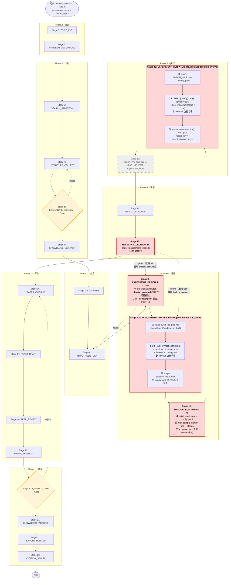

# AutoResearchClaw × LLM4AD 集成前后流程对比

> **v4 修订说明（对齐 collider 规范）**：早期版本把问题描述 `llm4ad_plan.md` 的生成放在
> **Stage 9 EXPERIMENT_DESIGN**。但 arc_bench 与 `--from-stage CODE_GENERATION` 都是**注入** Stage 9
> 而非执行它，导致该分支在测试/验证场景下永不触发、Stage 10 落到退化 fallback。现已将描述生成
> **移入 Stage 10 CODE_GENERATION**（与 collider 在 Stage 10 产 `collider_plan.md` 同构），Stage 9
> 恢复为通用未改，Stage 15 的 `pivot` 回滚也改回通用的 Stage 8。**本文档下方部分小节（含 mermaid
> 图与第 7 节数据流）仍保留旧的“Stage 9 产描述”叙述作为历史参考，正式行为以第 1、4、5、6 节
> 与代码为准。** 附录 A 记录 v1 历史。

## 1. 概览（一句话结论）

llm4ad **没有**替换整段流水线，而是在 `experiment.mode == "llm4ad_agent"` 时，对原 23 步流程中的 **4 个 stage** 做了行为分支改造（Stage 10 / 11 / 12 / 13），外加 Stage 15 的 agent 需求门，其余 stage 完全复用。**Stage 9 EXPERIMENT_DESIGN 保持通用、未改**——这一点与 collider/biology/stat 三个参考 agent 一致。llm4ad 的两大功能加上 llm4ad_plan 描述，**分别**落在 Stage 10（描述 + build）/ Stage 12（evolve）：

| 动作 | 落点 | 说明 |
|---|---|---|
| 写 llm4ad 问题描述（`llm4ad_plan.md`） | **Stage 10 CODE_GENERATION** | LLM 从**注入的** `exp_plan.yaml` + `hypotheses` 派生五段式问题描述（LLM 不可用走确定性 fallback），随后立即 build。与 collider 在 Stage 10 产 `collider_plan.md` 完全同构，因此在 arc_bench（Stage 9 被注入而非执行）下依然健壮。 |
| ① 根据描述生成 seed 算法 + 数据集 + evaluator + config | **Stage 10 CODE_GENERATION** | `Llm4adAgentSandbox.run_build()` 子进程调 `llm4ad.builder.build_task_sync(description)`；产 `build_result.json` 指向 `config.yaml` |
| 估算真实 evolve 成本（LLM 调用数 / 墙钟） | **Stage 11 RESOURCE_PLANNING** | 读 `build_result.json` → `config.yaml` → 提取 `max_sample_nums × generations × pop_size × num_islands`，估算墙钟；对比 `evolve_timeout_sec` 判断是否 fit |
| ② 执行演化算法实验（岛屿遗传等）→ 最优个体 | **Stage 12 EXPERIMENT_RUN** | `Llm4adAgentSandbox.run_evolve(config_path)` 子进程调 `LLM4AD(config).run()` 得到 `best_individual`；产 canonical `results.json` |

四个被改造的 stage（+ Stage 15 gate）一览：

| Stage | 原行为（ML 默认） | llm4ad_agent 模式行为 |
|---|---|---|
| **9 EXPERIMENT_DESIGN** | 产 `exp_plan.yaml` (Gate) | **未改——保持通用**。产 `exp_plan.yaml` 供 Stage 10 消费。 |
| **10 CODE_GENERATION** ⭐ | LLM 生成 Python 实验代码 + 静态检查 + 修复 | 读注入的 `exp_plan.yaml` → LLM 产五段式 `llm4ad_plan.md`（fallback 兜底）→ 跑 `build_task_sync` → 产 seed.py / evaluation.py / dataset / config.yaml；写 `build_result.json` |
| **11 RESOURCE_PLANNING** ⭐ | LLM 通用 GPU/时间估算 | 读 `config.yaml` 精算真实 evolve 成本；`will_fit_in_budget` 布尔 + warnings |
| **12 EXPERIMENT_RUN** ⭐ | sandbox/docker 里跑 python | 读 Stage 10 的 `build_result.json` → `run_evolve(config_path)` → `LLM4AD.run()` 岛屿 GA → 最优个体 |
| **13 ITERATIVE_REFINE** ⭐ | 迭代 edit-run-eval Python | **skip**（写占位符 `experiment_final/`）；LLM4AD 内部 build 已含 auto-repair |
| **15 RESEARCH_DECISION** | 默认决策逻辑 | 走 `_agent_requirements_decision` LLM 需求门；`refine` → **Stage 10**（重新 build + evolve），`pivot` → **Stage 8**（通用回滚，与其它 agent 模式一致） |

---

## 2. 原始 23 步流程图

按 `researchclaw/pipeline/stages.py:22-62` 的枚举顺序，分 8 个 Phase (A–H)：

```mermaid
flowchart TD
    Start([用户: researchclaw run --topic X]) --> S1

    subgraph PA["Phase A · 立题 Scoping"]
        S1[Stage 1: TOPIC_INIT<br/>goal.md · hardware_profile.json]
        S2[Stage 2: PROBLEM_DECOMPOSE<br/>problem_tree.md]
        S1 --> S2
    end

    subgraph PB["Phase B · 文献 Literature"]
        S3[Stage 3: SEARCH_STRATEGY<br/>search_plan.yaml]
        S4[Stage 4: LITERATURE_COLLECT<br/>candidates.jsonl]
        S5{Stage 5: LITERATURE_SCREEN<br/>Gate · shortlist.jsonl}
        S6[Stage 6: KNOWLEDGE_EXTRACT<br/>cards/]
        S3 --> S4 --> S5 --> S6
        S5 -. reject .-> S4
    end

    subgraph PC["Phase C · 综合 Synthesis"]
        S7[Stage 7: SYNTHESIS<br/>synthesis.md]
        S8[Stage 8: HYPOTHESIS_GEN<br/>hypotheses.md]
        S7 --> S8
    end

    subgraph PD["Phase D · 设计 Design"]
        S9{Stage 9: EXPERIMENT_DESIGN<br/>Gate · exp_plan.yaml}
        S10[Stage 10: CODE_GENERATION<br/>experiment/ · experiment_spec.md]
        S11[Stage 11: RESOURCE_PLANNING<br/>schedule.json]
        S9 --> S10 --> S11
        S9 -. reject .-> S8
    end

    subgraph PE["Phase E · 执行 Execution"]
        S12[Stage 12: EXPERIMENT_RUN<br/>runs/ · sandbox/docker/ssh]
        S13[Stage 13: ITERATIVE_REFINE<br/>refinement_log.json · experiment_final/]
        S12 --> S13
    end

    subgraph PF["Phase F · 决策 Decision"]
        S14[Stage 14: RESULT_ANALYSIS<br/>analysis.md]
        S15[Stage 15: RESEARCH_DECISION<br/>decision.md]
        S14 --> S15
    end

    subgraph PG["Phase G · 写作 Writing"]
        S16[Stage 16: PAPER_OUTLINE<br/>outline.md]
        S17[Stage 17: PAPER_DRAFT<br/>paper_draft.md]
        S18[Stage 18: PEER_REVIEW<br/>reviews.md]
        S19[Stage 19: PAPER_REVISION<br/>paper_revised.md]
        S16 --> S17 --> S18 --> S19
    end

    subgraph PH["Phase H · 收尾 Finalize"]
        S20{Stage 20: QUALITY_GATE<br/>Gate · quality_report.json}
        S21[Stage 21: KNOWLEDGE_ARCHIVE<br/>archive.md]
        S22[Stage 22: EXPORT_PUBLISH<br/>paper_final.md · code/]
        S23[Stage 23: CITATION_VERIFY<br/>verification_report.json]
        S20 --> S21 --> S22 --> S23
        S20 -. reject .-> S16
    end

    S2  --> S3
    S6  --> S7
    S8  --> S9
    S11 --> S12
    S13 --> S14
    S15 --> S16
    S19 --> S20
    S23 --> Done([完成: 会议投稿级论文包])

    S15 -. "pivot (≤2 次)" .-> S8
    S15 -. refine .-> S13

    classDef gate fill:#fff4d6,stroke:#e0a800,stroke-width:2px
    class S5,S9,S20 gate
```



**图例说明**：
- 矩形 `[]` = 普通 stage；菱形 `{}` = **Gate**（拒绝会回滚到上游）
- 虚线箭头 = 回滚/循环路径
- Gate 三处：Stage 5（文献筛选）/ Stage 9（实验方案）/ Stage 20（论文质量）
- Stage 15 决策路径：`proceed` → S16 / `refine` → S13 / `pivot` → S8（≤2 次防死循环，见 `stages.py:129-134`）

---

## 3. 集成 llm4ad 后的流程图（v3 语义对齐版 · 历史参考）

> ⚠️ **本节为 v3 历史快照**：其 mermaid 图与叙述仍把描述生成画在 Stage 9、pivot 回 Stage 9。
> v4 已将描述生成移入 Stage 10、pivot 回通用 Stage 8（见顶部修订说明与第 1/4/5/6 节）。阅读本节
> 时请把“Stage 9 产 llm4ad_plan.md”整体读作“Stage 10 产”，“pivot → S9”读作“pivot → S8”。

*红色* 高亮 = 被 llm4ad 集成改造的 stage。llm4ad 的三个动作（写描述 / build / evolve）现在**分别**落在 Stage 9 / 10 / 12，每个 stage 名字都名副其实。**Stage 10 和 Stage 12 各自展开子图**，直观呈现"build 属于 CODE_GENERATION 语义"、"evolve 属于 EXPERIMENT_RUN 语义"。



**关键变化点（对照第 2 节的原图，以及本文档 v1/v2 版本）**：

1. **Stage 9 EXPERIMENT_DESIGN**：新增 llm4ad_agent 分支——在通用 `exp_plan.yaml` 之外**额外产**五段式 `llm4ad_plan.md`（Problem / Function to evolve / Objective / Seed algorithm / Evaluation）。Gate 在此审 description 质量，可**在花 build/evolve 成本之前**拒绝低质量描述。
2. **Stage 10 CODE_GENERATION**：不再"只写 md"（v1 错误做法）也不再"顺手也写 md"（v2 半错做法），而是**真做 build**——读 Stage 9 的 `llm4ad_plan.md`，调 `build_task_sync` 产出 seed.py / evaluation.py / dataset / config.yaml，写 `build_result.json`。这才是 llm4ad **功能 ①** 的正身。
3. **Stage 11 RESOURCE_PLANNING**：新增 llm4ad_agent 分支——读 `build_result.json → config.yaml`，提取 `max_sample_nums × pop_size × generations × num_islands` 估算真实 evolve 成本；输出 `will_fit_in_budget` 判断，超支时写 warnings。以前这里对 llm4ad 是走过场，现在有真数字。
4. **Stage 12 EXPERIMENT_RUN**：**只做 evolve**——读 Stage 10 的 `build_result.json` 拿到 config_path，调 `LLM4AD(config).run()` 岛屿 GA。这才是 llm4ad **功能 ②** 的正身。
5. **Stage 13 ITERATIVE_REFINE**：写占位符 skip（LLM4AD 内部 build 已含 auto-repair）。
6. **Stage 15 RESEARCH_DECISION 的回滚箭头**：
   - `pivot` 从原来的 `→ S8` 改指 **`→ S9`**（llm4ad 场景下 pivot 语义是"重写 description"，比"扔掉假设"更精准）
   - `refine` 从原来的 `→ S13` 改指 **`→ S10`**（重跑 build+evolve；因为 Stage 13 是 skip 的，回它没意义）

---

### 3.1 每一步在干啥（步骤说明 · 依赖 → 产出）

下表逐条解释上面流程图里 23 个 stage：**一句话职责** + **依赖哪些数据（输入）** + **产出哪些数据（输出）**。`★` = 被 llm4ad 改造的 6 步（9/10/11/12/13/15）；`⛩` = Gate（拒绝会回滚上游）；其余为通用步骤，llm4ad 模式下行为与 ML 默认一致。

| Stage | 一句话职责 | 依赖数据（输入） | 产出数据（输出） |
|---|---|---|---|
| **1 TOPIC_INIT** | 把用户 `--topic` 落成研究目标并探测本机算力。 | 用户命令行 topic + 运行环境（无上游文件） | `goal.md`（结构化研究目标）、`hardware_profile.json`（本机 CPU/GPU/内存画像） |
| **2 PROBLEM_DECOMPOSE** | 把大目标拆成可攻关的子问题树。 | `goal.md`（研究目标） | `problem_tree.md`（子问题层级树） |
| **3 SEARCH_STRATEGY** | 为子问题生成文献检索关键词与来源计划。 | `problem_tree.md`（子问题树） | `search_plan.yaml`（检索关键词/数据源/时间范围） |
| **4 LITERATURE_COLLECT** | 按检索计划抓取候选文献。 | `search_plan.yaml`（检索计划） | `candidates.jsonl`（候选文献元数据逐行列表） |
| **5 LITERATURE_SCREEN ⛩** | 筛掉不相关文献、留下 shortlist（不合格回退 S4）。 | `candidates.jsonl`（候选文献） | `shortlist.jsonl`（通过筛选的文献短名单） |
| **6 KNOWLEDGE_EXTRACT** | 从入选文献抽取结构化知识卡片。 | `shortlist.jsonl`（文献短名单） | `cards/`（每篇一张的结构化知识卡片目录） |
| **7 SYNTHESIS** | 把知识卡片综合成领域现状与空白。 | `cards/`（知识卡片） | `synthesis.md`（领域现状/研究空白综述） |
| **8 HYPOTHESIS_GEN** | 基于综合结论生成可检验的研究假设。 | `synthesis.md`（综述） | `hypotheses.md`（可检验研究假设清单） |
| **9 EXPERIMENT_DESIGN ★⛩** | 设计实验方案，并额外派生五段式 llm4ad 问题描述；Gate 先审描述质量再放行（不合格回退 S8）。 | `hypotheses.md`（研究假设，S8）、`synthesis.md`（综述，S7） | `exp_plan.yaml`（通用实验方案：baselines/metrics/protocol）、**`llm4ad_plan.md`**（五段式问题描述，S10 输入）、`llm4ad_meta.json`（描述生成元数据/来源标记） |
| **10 CODE_GENERATION ★** | 读问题描述跑 `build_task_sync`，生成种子算法/评估器/数据集/演化配置（llm4ad 功能①）。 | **`stage-09/llm4ad_plan.md`**（五段式问题描述） | **`build_result.json`**（build 结果索引，含 `config_path`，S11/S12 输入）、`seed.py`（种子算法）、`evaluation.py`（确定性评估器）、`dataset/`（评估数据）、`config.yaml`（演化超参+LLM 凭证）、`experiment_spec.md`（人读构建摘要） |
| **11 RESOURCE_PLANNING ★** | 读演化配置精算真实 evolve 成本，判断是否在预算内。 | **`stage-10/build_result.json`**（build 索引）→ `config.yaml`（演化配置） | `schedule.json`（成本估算：`estimated_llm_calls`、`estimated_wall_sec`、`will_fit_in_budget`、`warnings`） |
| **12 EXPERIMENT_RUN ★** | 用配置跑 `LLM4AD.run()` 岛屿遗传演化，取最优个体（llm4ad 功能②）。 | **`stage-10/build_result.json`**（build 索引）→ `config_path`（演化配置路径） | `runs/results.json`（canonical 实验结果，含最优个体分数/代码）、`run-1.json`（sandbox 运行元数据）、演化 checkpoints/logs（岛屿 GA 中间产物） |
| **13 ITERATIVE_REFINE ★** | 跳过外层精化（build 内部已含 auto-repair），只落占位符。 | 无（skip） | `refinement_log.json`（精化日志占位，`skipped=true`）、`experiment_final/`（从 S12 runs/ 拷贝的最终产物目录） |
| **14 RESULT_ANALYSIS** | 解读实验结果、判断假设是否被支持。 | **`stage-12/runs/results.json`**（canonical 实验结果） | `analysis.md`（结果解读与假设结论）、`experiment_summary.json`（结构化结果摘要） |
| **15 RESEARCH_DECISION ★** | 走 LLM 需求门决定 proceed / refine / pivot（refine 回 S10，pivot 回 S9）。 | `analysis.md`（结果解读） | `decision.md`（决策结论 + proceed/refine/pivot 回滚指令） |
| **16 PAPER_OUTLINE** | 生成论文结构大纲。 | `analysis.md`（结果解读）、`decision.md`（决策） | `outline.md`（论文章节大纲） |
| **17 PAPER_DRAFT** | 按大纲写出论文初稿。 | `outline.md`（论文大纲） | `paper_draft.md`（论文初稿） |
| **18 PEER_REVIEW** | 模拟同行评审给出修改意见。 | `paper_draft.md`（论文初稿） | `reviews.md`（模拟评审意见） |
| **19 PAPER_REVISION** | 依据评审意见修订论文。 | `paper_draft.md`（初稿）、`reviews.md`（评审意见） | `paper_revised.md`（修订稿） |
| **20 QUALITY_GATE ⛩** | 质量门总检，不达标回退 S16 重写。 | `paper_revised.md`（修订稿） | `quality_report.json`（质量评分/通过判定） |
| **21 KNOWLEDGE_ARCHIVE** | 把本轮研究沉淀归档。 | `paper_revised.md`（修订稿）、`quality_report.json`（质量报告） | `archive.md`（本轮研究归档记录） |
| **22 EXPORT_PUBLISH** | 导出投稿级论文包与代码。 | `paper_revised.md`（修订稿）、`archive.md`（归档记录） | `paper_final.md`（最终论文）、`code/`（可复现代码包） |
| **23 CITATION_VERIFY** | 核验引用真实性与可追溯性。 | `paper_final.md`（最终论文） | `verification_report.json`（引用核验报告） |

> 提示：想看 llm4ad 关键交接（`llm4ad_plan.md` / `build_result.json` / `schedule.json` / `results.json`）的**字段级 JSON 契约**，见第 7 节；本表只给"每步做什么 + 进什么 + 出什么"的速览。

---

## 4. 改动对照表（v3 版）

| # | Stage | 原行为 | llm4ad_agent 模式行为 | 关键代码 |
|---|---|---|---|---|
| 9 | EXPERIMENT_DESIGN | LLM 产 `exp_plan.yaml`（baselines/metrics/protocol）+ 通用 Gate | **未改——保持通用**。产 `exp_plan.yaml` 供 Stage 10 消费。（v4 前曾在此额外产 `llm4ad_plan.md`，现已移入 Stage 10。） | `pipeline/stage_impls/_experiment_design.py`（无 llm4ad 分支） |
| 10 | CODE_GENERATION | LLM 生成多文件 Python 项目 + 静态检查 + 自动修复 | 读注入的 `exp_plan.yaml` + `hypotheses.json` → LLM 产五段式 `llm4ad_plan.md`（LLM 不可用走 `_fallback_llm4ad_plan`）→ `Llm4adAgentSandbox.run_build()` 子进程 → `build_task_sync(description)` → 产 `seed.py` / `evaluation.py` / `dataset/` / `config.yaml`；写 `stage-10/build_result.json` 声明 `config_path`。与 `_execute_collider_plan_generation` 同构。 | `pipeline/stage_impls/_code_generation.py:_execute_llm4ad_plan_generation`<br/>`experiment/llm4ad_agent_sandbox.py:run_build`<br/>`experiment/llm4ad_driver.py:_run_build_only` |
| 11 | RESOURCE_PLANNING | LLM 通用 GPU/时间估算（对 llm4ad 走过场） | 读 `build_result.json → config.yaml`，提取 `max_sample_nums / generations / pop_size / num_islands / num_samplers`，估算 `estimated_llm_calls` + `estimated_wall_sec`；输出 `will_fit_in_budget` + `warnings` | `pipeline/stage_impls/_execution.py:_plan_llm4ad_resources` |
| 12 | EXPERIMENT_RUN | `create_sandbox(config)` 分派到 sandbox / docker / ssh_remote 跑 python | 读 `stage-10/build_result.json` → `config_path` → `Llm4adAgentSandbox.run_evolve(config_path)` → 子进程 `LLM4AD(config).run()` 岛屿 GA → best_individual → 写 canonical `results.json`。build_result 缺失时 fallback 到 legacy `sandbox.run()` 双阶段 | `pipeline/stage_impls/_execution.py`（`mode == "llm4ad_agent"` 分支）<br/>`experiment/llm4ad_agent_sandbox.py:run_evolve`<br/>`experiment/llm4ad_driver.py:_run_evolve_only` |
| 13 | ITERATIVE_REFINE | 迭代 edit-run-eval 精化 Python 代码 | **直接返回**：写占位符 `experiment_final/` 然后跳过。LLM4AD 内部 `build_task_sync` 已含 `max_repair_attempts=10` 的 auto-repair 预算，不需要外层再精化。 | `pipeline/stage_impls/_execution.py`（skip 名单包含 `"llm4ad_agent"`） |
| 15 | RESEARCH_DECISION | 默认基于指标的决策逻辑；`refine → S13`, `pivot → S8` | 走 `_agent_requirements_decision`（LLM 需求门）；**回滚目标**：`refine → S10`（重跑 build+evolve），`pivot → S8`（通用回滚，与 collider/biology/stat 一致）| `pipeline/stage_impls/_analysis.py:_execute_research_decision`<br/>`pipeline/runner.py`（agent-mode 分支：refine → CODE_GENERATION；pivot 用通用 HYPOTHESIS_GEN） |

**其他非 stage 改动**（配套支持）：
- `researchclaw/config.py`：`EXPERIMENT_MODES` 加入 `"llm4ad_agent"`；`Llm4adAgentConfig` dataclass（`llm4ad_dir` / `working_dir` / `timeout_sec` / **`build_timeout_sec`** / **`evolve_timeout_sec`** / `python_binary` / `build_api_key/model/base_url` / `max_repair_attempts` / `build_max_tries` / `resume_from_checkpoint` / `metric_direction`）与 YAML 解析器（含旧字段兜底）。
- `researchclaw/pipeline/runner.py`：`_safe_rename_stage_dir()` 给 Windows 上 pivot/refine 回滚时的 `WinError 5` 加 5 次 retry + copytree/rmtree fallback。
- `researchclaw/domains/profiles/algorithm_evolution.yaml`：声明 `build_timeout_sec: 900` / `evolve_timeout_sec: 7200`；覆盖 `figure_agent.use_docker: false`（避免 Stage 14 FigureAgent 依赖缺失的 `researchclaw/experiment:latest` 镜像）。
- `researchclaw/domains/adapters/algorithm_evolution.py`：`AlgorithmEvolutionPromptAdapter`。
- `researchclaw/domains/detector.py`：新增关键词规则 `["llm4ad", "algorithm evolution", "evolve algorithm", "island genetic algorithm", "funsearch", "eureka heuristic", ...] → "algorithm_evolution"`；**故意放在 ML 规则之前**，避免 "llm" 关键词被 ML catch-all 吞掉。
- `researchclaw/domains/prompt_adapter.py`：在 adapter registry 注册 `algorithm_evolution`。
- `researchclaw/domains/deploy.py`：把 `llm4ad_agent` 加入 `_NESTED_BLOCK_FIELDS`。

---

## 5. llm4ad 两大功能的精确落点

### 功能 ① — Build：根据描述生成算法/数据集/评估代码 → **Stage 10 CODE_GENERATION**

**Stage 10 handler**：`researchclaw/pipeline/stage_impls/_code_generation.py::_execute_llm4ad_plan_generation`
**Sandbox 入口**：`researchclaw/experiment/llm4ad_agent_sandbox.py::Llm4adAgentSandbox.run_build`
**子进程实际调用**：`researchclaw/experiment/llm4ad_driver.py::_build`

```python
# Stage 10 handler 读 Stage 9 产出的 llm4ad_plan.md, 然后调:
plan_text = _read_prior_artifact(run_dir, "llm4ad_plan.md")  # ← Stage 9 产
sandbox = Llm4adAgentSandbox(la_cfg, workspace)
build_result = sandbox.run_build(plan_text)                    # ← 起子进程

# 子进程 (llm4ad_driver.py::_build) 里最终:
from llm4ad.builder import build_task_sync
from llm4ad.builder.pipeline import BuildError

task_dir = build_task_sync(
    description=description,          # 由 Stage 9 产出、Stage 10 读入的 llm4ad_plan.md
    output_dir=output_dir,             # stage-10/llm4ad_workspace/task/
    project_name=project_name,         # 默认 "evolved_task"
    api_key=api_key, model=model, base_url=base_url,   # 由 Llm4adAgentConfig.build_* 传入
    max_repair_attempts=max_repair_attempts,           # 默认 10 次 auto-repair
    on_progress=_on_progress,
)
config_path = Path(task_dir) / "config.yaml"
# Stage 10 sandbox 再把 config_path 写进 build_result.json 供 Stage 11/12 使用
```

**产出目录结构**（**Stage 10 运行时生成**，仓库里没有预置模板）：

```
stage-10/
├── llm4ad_plan.md            # 镜像 Stage 9 的 llm4ad_plan.md, 便于本地调试
├── llm4ad_meta.json          # build 元数据 (状态, 耗时, plan_source)
├── build_result.json         # ★ Stage 11/12 消费的桥梁, 声明 config_path
├── experiment/               # Stage 10 契约兼容占位
├── experiment_spec.md        # 人读的构建结果摘要
└── llm4ad_workspace/
    └── task/
        └── evolved_task/
            ├── seed.py           # 种子算法（LLM 根据 description 生成）
            ├── evaluation.py     # 确定性 evaluator
            ├── dataset/          # 训练/评估数据
            ├── config.yaml       # 演化超参 + LLM_API_KEY/BASE_URL/MODEL 环境变量
            └── main.py           # 入口（可选，仓库外流程直接调 LLM4AD 类）
```

### 功能 ② — Evolve：执行演化算法得到最优个体 → **Stage 12 EXPERIMENT_RUN**

**Stage 12 handler**：`researchclaw/pipeline/stage_impls/_execution.py`（`mode == "llm4ad_agent"` 分支）
**Sandbox 入口**：`researchclaw/experiment/llm4ad_agent_sandbox.py::Llm4adAgentSandbox.run_evolve`
**子进程实际调用**：`researchclaw/experiment/llm4ad_driver.py::_evolve`

```python
# Stage 12 handler 读 Stage 10 产出的 build_result.json, 然后调:
build_doc = json.loads(_read_prior_artifact(run_dir, "build_result.json"))
config_path = Path(build_doc["config_path"])                   # ← Stage 10 产
sandbox = Llm4adAgentSandbox(la_cfg, workspace)
result = sandbox.run_evolve(config_path)                       # ← 起子进程

# 子进程 (llm4ad_driver.py::_evolve) 里最终:
from llm4ad import LLM4AD

llm4ad = LLM4AD(str(config_path))       # 加载 Stage 10 build 产出的 config.yaml
llm4ad.print_run_summary()
result = asyncio.run(llm4ad.run(
    resume_from_checkpoint=resume,      # Llm4adAgentConfig.resume_from_checkpoint
))
best = result.best_individual           # → {score, code / algorithm / program / function}
```

结果统一写成与其它 agent sandbox 一致的 canonical `results.json`：

```json
{
  "primary_metric": <best_score>,
  "metric_key": "best_individual_score",
  "metrics": {"best_individual_score": ..., "llm4ad_agent_success": 1, "llm4ad_evolve_success": 1, "figures_produced": ..., "scripts_generated": ...},
  "hypotheses": {...},
  "summary": "...",
  "structured_results": {"artifacts": {...}, "best_code": "...", "run_directory": "..."},
  "status": "ok"
}
```

### 附加：描述文本 llm4ad_plan.md → **Stage 10 CODE_GENERATION**

**Stage 10 handler**：`researchclaw/pipeline/stage_impls/_code_generation.py::_execute_llm4ad_plan_generation`

Stage 10 在 build 之前，先读**注入的** `exp_plan.yaml` + `hypotheses.json`，用五段式模板调 LLM 产 `llm4ad_plan.md`（LLM 不可用走 `_fallback_llm4ad_plan`），随即用它跑 `build_task_sync`。之所以放在 Stage 10 而**不是** Stage 9：arc_bench 的 `prepare_run.py` 与产品级 `--from-stage CODE_GENERATION` 都是**注入** Stage 9（只物化 `exp_plan.yaml` + checkpoint）而非执行它，所以任何 Stage 9 分支在验证场景下都不会触发。collider 出于同样原因把 `collider_plan.md` 放在 Stage 10——从注入的 `exp_plan.yaml` 确定性地重新生成，天然对“注入式 Stage 9”健壮。llm4ad 现已与之对齐。

### Build LLM 与 Evolve LLM 的凭证分离

- **Build 阶段** LLM（Stage 10 用）：`Llm4adAgentConfig.build_api_key / build_model / build_base_url`（生成 seed/evaluator/dataset 时用）；
- **Evolve 阶段** LLM（Stage 12 用）：走 LLM4AD 生成的 `config.yaml` 里的 `LLM_API_KEY / LLM_BASE_URL / LLM_MODEL` 环境变量（sandbox 会自动把 `build_*` 兜底透传，避免重复配置）。
- **Stage 10 写 llm4ad_plan.md** 用的是 AutoResearchClaw pipeline 的主 LLM（`researchclaw.llm.client.LLMClient`），不占 llm4ad 凭证。

---

## 6. 未改动的 18 步（可放心的部分）

以下 stage 在 `llm4ad_agent` 模式下**完全不感知 llm4ad 的存在**，行为与 ML 默认路径一致（改动的 4 步是 **10 / 11 / 12 / 13**，外加 Stage 15 的 agent 需求门）：

| Phase | Stage |
|---|---|
| A · 立题 | 1 TOPIC_INIT, 2 PROBLEM_DECOMPOSE |
| B · 文献 | 3 SEARCH_STRATEGY, 4 LITERATURE_COLLECT, 5 LITERATURE_SCREEN (Gate), 6 KNOWLEDGE_EXTRACT |
| C · 综合 | 7 SYNTHESIS, 8 HYPOTHESIS_GEN |
| D · 设计 | **9 EXPERIMENT_DESIGN**（通用未改，产 `exp_plan.yaml` 供 Stage 10 消费） |
| F · 决策 | 14 RESULT_ANALYSIS |
| G · 写作 | 16 PAPER_OUTLINE, 17 PAPER_DRAFT, 18 PEER_REVIEW, 19 PAPER_REVISION |
| H · 收尾 | 20 QUALITY_GATE (Gate), 21 KNOWLEDGE_ARCHIVE, 22 EXPORT_PUBLISH, 23 CITATION_VERIFY |

**注**：Stage 9 EXPERIMENT_DESIGN 完全**保持通用**（产 `exp_plan.yaml` + Gate 逻辑），不再产 llm4ad_plan.md——描述生成已移入 Stage 10，正是为了在 arc_bench（Stage 9 被注入而非执行）下可被验证。Stage 11 RESOURCE_PLANNING 的**契约（产 `schedule.json`）没变**，只是 llm4ad 分支用真数字替代通用估算。所以从下游 Stage 14/15 视角看，这些步骤依然"感觉不到 llm4ad"。

也就是说，从"选题→文献综述→假设生成→实验设计→资源规划"，以及后半段的"分析→写论文→评审→质量门→归档→发表→引用核验"，都沿用了 AutoResearchClaw 原来那套 domain-agnostic 的流水线；llm4ad 只是把原本"写 Python + 跑 Python + 精化 Python"的实验中段替换成了"生成 problem description → build + evolve"。

---

## 附录：关键文件路径速查

| 用途 | 文件 |
|---|---|
| 23 步枚举定义 | `researchclaw/pipeline/stages.py:22-62` |
| Stage → handler 分发表 | `researchclaw/pipeline/executor.py` |
| Gate 与通用回滚规则 | `researchclaw/pipeline/stages.py`（`GATE_STAGES` + `DECISION_ROLLBACK`） |
| llm4ad 沙箱主体（含 `run_build` / `run_evolve` / legacy `run`） | `researchclaw/experiment/llm4ad_agent_sandbox.py` |
| llm4ad 子进程驱动（`phase=build/evolve/both`） | `researchclaw/experiment/llm4ad_driver.py` |
| Stage 9 EXPERIMENT_DESIGN | **通用未改**（无 llm4ad 分支）`researchclaw/pipeline/stage_impls/_experiment_design.py` |
| **Stage 10 llm4ad 分支**（产 llm4ad_plan.md + 跑 build_task_sync） | `researchclaw/pipeline/stage_impls/_code_generation.py:_execute_llm4ad_plan_generation` |
| **Stage 11 llm4ad 分支**（真实成本估算） | `researchclaw/pipeline/stage_impls/_execution.py:_plan_llm4ad_resources` |
| **Stage 12 llm4ad 分支**（跑 evolve） | `researchclaw/pipeline/stage_impls/_execution.py`（`mode == "llm4ad_agent"` 分支） |
| Stage 13 skip 名单 | `researchclaw/pipeline/stage_impls/_execution.py:_execute_iterative_refine`（agent 名单含 `llm4ad_agent`） |
| Stage 15 agent 需求门 | `researchclaw/pipeline/stage_impls/_analysis.py:_execute_research_decision` |
| Stage 15 回滚目标 | `researchclaw/pipeline/runner.py`（agent-mode 分支：refine → CODE_GENERATION；pivot 用通用 HYPOTHESIS_GEN） |
| Windows rename retry + copytree fallback | `researchclaw/pipeline/runner.py:_safe_rename_stage_dir` |
| Sandbox 工厂分派 | `researchclaw/experiment/factory.py:create_sandbox`（`llm4ad_agent` 分支） |
| 模式注册 + 配置类 | `researchclaw/config.py`（`EXPERIMENT_MODES` + `Llm4adAgentConfig`；含 `build_timeout_sec` / `evolve_timeout_sec`） |
| 领域 profile | `researchclaw/domains/profiles/algorithm_evolution.yaml` |
| Prompt adapter | `researchclaw/domains/adapters/algorithm_evolution.py` |
| Detector 关键词 | `researchclaw/domains/detector.py`（`algorithm_evolution` 规则） |

**参考 commit**：`7eb1507 适配llm4ad`（初版），后续 v2/v3 语义对齐重构基于该 commit 演进。

---

## 7. v3 语义对齐版：分步映射后的输入输出契约

> ⚠️ **本节为 v3 历史快照**：数据流把 `llm4ad_plan.md` 归到 `stage-09/`、pivot 回 Stage 9。
> v4 中该文件产于 **Stage 10**（`stage-10/llm4ad_plan.md`，从注入的 `exp_plan.yaml` 生成），pivot 回
> 通用 **Stage 8**。除这两点外，build_result.json / results.json 等字段级契约均仍有效。

对齐产品语义（Stage 9 设计、Stage 10 生成代码、Stage 11 规划、Stage 12 执行）之后，每个 stage 的**输入 / 副作用 / 输出**都变得名副其实、可独立测试、可独立回滚。下表描述完整的 stage 之间的数据流（仅列出 llm4ad_agent 模式下的 8→13 段，其余步骤沿用 pipeline 通用契约）：

### 7.1 数据流一览

```
Stage 8  HYPOTHESIS_GEN (通用, 不改)
    └─ 输出:  stage-08/hypotheses.md
                    │
                    ▼
Stage 9  EXPERIMENT_DESIGN (llm4ad_agent branch)
    ├─ 输入:  hypotheses.md (Stage 8), synthesis.md (Stage 7)
    ├─ 动作:  ① 通用: LLM 写 exp_plan.yaml (baselines/metrics/protocol)
    │        ② llm4ad 附加: LLM 写 llm4ad_plan.md (Problem/Function/
    │                        Objective/Seed/Evaluation 五段式)
    ├─ 输出:  stage-09/exp_plan.yaml       (通用契约)
    │         stage-09/llm4ad_plan.md      ★ 关键: Stage 10 的输入
    │         stage-09/llm4ad_meta.json
    └─ Gate:  LLM 审 experiment design — 若 description 含糊/不可测量, 拒
                    │
                    ▼
Stage 10 CODE_GENERATION (llm4ad_agent branch)
    ├─ 输入:  ★ stage-09/llm4ad_plan.md (通过 _read_prior_artifact 跨 stage 读)
    ├─ 副作用: 起 Llm4adAgentSandbox.run_build() 子进程
    │         → llm4ad.builder.build_task_sync(description)
    │         → 花费: build_timeout_sec (默认 900s / 15 min)
    │         → 花费: max_repair_attempts × build_max_tries 次 LLM 调用
    └─ 输出:  stage-10/llm4ad_plan.md            (镜像 stage-9, 便于本地调试)
              stage-10/llm4ad_meta.json          (build 元数据)
              stage-10/build_result.json         ★ 关键: Stage 11/12 的输入
              stage-10/llm4ad_workspace/
                └── task/evolved_task/
                    ├── seed.py                  (LLM4AD 生成的种子算法)
                    ├── evaluation.py            (LLM4AD 生成的评估器)
                    ├── dataset/                 (LLM4AD 生成的评估数据)
                    └── config.yaml              (LLM4AD 生成的演化配置)
              stage-10/experiment/               (Stage 10 契约兼容占位)
              stage-10/experiment_spec.md        (人读的构建结果摘要)
                    │
                    ▼
Stage 11 RESOURCE_PLANNING (llm4ad_agent branch)
    ├─ 输入:  ★ stage-10/build_result.json → config_path
    ├─ 动作:  读 config.yaml 提取 max_sample_nums / generations / pop_size /
    │        num_islands / num_samplers → 估算真实 LLM 调用数 + 墙钟
    └─ 输出:  stage-11/schedule.json (含 evolve_parameters, estimated_llm_calls,
                                       estimated_wall_sec, will_fit_in_budget,
                                       warnings 数组)
                    │
                    ▼
Stage 12 EXPERIMENT_RUN (llm4ad_agent branch)
    ├─ 输入:  ★ stage-10/build_result.json → config_path
    │        (Stage 11 的 schedule.json 仅供人读, 不影响执行路径)
    ├─ 副作用: 起 Llm4adAgentSandbox.run_evolve(config_path) 子进程
    │         → LLM4AD(config).run() 岛屿 GA
    │         → 花费: evolve_timeout_sec (默认 7200s / 2h)
    │         → 花费: 数十~数千次 evolve LLM 调用
    └─ 输出:  stage-12/runs/results.json         ★ canonical 契约
              stage-12/runs/run-1.json           (sandbox 元数据)
              stage-12/runs/llm4ad_workspace/    (演化 checkpoints / logs)
                    │
                    ▼
Stage 13 ITERATIVE_REFINE
    ├─ 输入:  (无 — llm4ad 内部 build 已含 auto-repair)
    └─ 输出:  stage-13/refinement_log.json (skipped=true)
              stage-13/experiment_final/  (从 stage-12/runs/ 拷贝)
                    │
                    ▼
Stage 14 RESULT_ANALYSIS (原样通用)
    ├─ 输入:  ★ stage-12/runs/results.json (canonical schema, 与 ML 模式同)
    └─ 输出:  stage-14/analysis.md, experiment_summary.json, ...
                    │
                    ▼
Stage 15 RESEARCH_DECISION (agent 需求门)
    │
    ├─ decision = proceed → Stage 16 (写论文)
    ├─ decision = refine  → 回滚到 Stage 10 (重跑 build + evolve)
    └─ decision = pivot   → 回滚到 Stage 9  (重写 llm4ad_plan.md)
```

### 7.2 关键交接契约详解

**契约 1: `stage-09/llm4ad_plan.md`** — Stage 9 → Stage 10 的桥梁

Stage 9 的 LLM 用五段式模板产出问题描述文本。Stage 10 通过 `_read_prior_artifact(run_dir, "llm4ad_plan.md")` 跨 stage 读取。Gate 在 Stage 9 判断这份 description 是否可 build。

**契约 2: `stage-10/build_result.json`** — Stage 10 → Stage 11 / Stage 12 的桥梁

```json
{
  "status": "success",
  "task_dir": "C:/.../stage-10/llm4ad_workspace/task/evolved_task",
  "config_path": "C:/.../stage-10/llm4ad_workspace/task/evolved_task/config.yaml",
  "seed_path": "C:/.../seed.py",
  "evaluation_path": "C:/.../evaluation.py",
  "dataset_dir": "C:/.../dataset",
  "project_name": "evolved_task",
  "source": "llm4ad_agent:build",
  "returncode": 0,
  "elapsed_sec": 342.5,
  "timed_out": false,
  "artifacts": {"figures": [], "data": [...], "scripts": [...], "logs": []}
}
```

- Stage 11 读它 → 找到 `config_path` → 打开 config.yaml 估算 evolve 成本
- Stage 12 读它 → 找到 `config_path` → 直接调 `sandbox.run_evolve(config_path)`

**契约 3: `stage-11/schedule.json` (llm4ad 版)**

```json
{
  "mode": "llm4ad_agent",
  "config_path": "C:/.../config.yaml",
  "build_status": "success",
  "evolve_parameters": {
    "max_sample_nums": 500,
    "num_samplers": 4,
    "num_islands": 4,
    "generations": null,
    "pop_size": null,
    "seconds_per_call_assumed": 8
  },
  "estimated_llm_calls": 500,
  "estimated_wall_sec": 1000,
  "evolve_timeout_sec": 7200,
  "build_timeout_sec": 900,
  "will_fit_in_budget": true,
  "tasks": [
    {"id": "llm4ad-build",  "name": "...", "status": "completed",
     "estimated_minutes": 5.7},
    {"id": "llm4ad-evolve", "name": "...", "status": "pending",
     "estimated_minutes": 16.7, "estimated_llm_calls": 500}
  ]
}
```

用户/HITL 可以在 Stage 11 之后、Stage 12 之前**介入**——比如看到 `will_fit_in_budget: false` 时手动调低 `max_sample_nums` 再继续。

**契约 4: `stage-12/runs/results.json`** — Stage 12 → Stage 14 的桥梁

这个 schema **完全没变**，与 ML/collider/biology 模式的 `results.json` 同构。Stage 14 / 15 / 需求 gate 只依赖 `primary_metric / metric_key / metrics / hypotheses / summary / structured_results / status` 这几个字段，感知不到 llm4ad 存在。

```json
{
  "primary_metric": 0.847,
  "metric_key": "best_individual_score",
  "metrics": {
    "best_individual_score": 0.847,
    "llm4ad_agent_success": 1.0,
    "llm4ad_evolve_success": 1.0,
    "figures_produced": 3,
    "scripts_generated": 7,
    "hypothesis_h1_supported": 1.0
  },
  "hypotheses": {"h1": {"supported": true, "value": 0.847, "details": "..."}},
  "summary": "LLM4AD evolution finished with state=success; best score=0.847.",
  "structured_results": {
    "state": "success",
    "best_algorithm": "def solve(instance):\n    ...",
    "llm4ad_run_directory": "C:/.../runs/..."
  },
  "status": "success"
}
```

### 7.3 回滚路径（Stage 15 决策）

拆分后 Stage 15 的回滚目标语义变精确了：

| 决策 | llm4ad_agent 回滚目标 | 语义 | 成本 |
|---|---|---|---|
| `proceed` | (不回滚) → Stage 16 | 结果可以写进论文 | 0 |
| `refine` | **Stage 10** | "描述没错，但 seed / evaluator / 参数不好，重新 build+evolve" | build + evolve |
| `pivot` | **Stage 8**（通用 HYPOTHESIS_GEN） | "更上游出了问题，丢弃假设重新生成"——与 collider/biology/stat 一致 | 假设 + 设计 + build + evolve |

**为什么 pivot 回到通用 Stage 8**：描述生成已移入 Stage 10（从注入的 exp_plan 确定性重建），
所以“重写描述”本身就属于 refine 触发的 Stage 10 重跑范畴；真正需要 pivot 的场景是更上游的
假设/设计层面出问题，回到通用的 Stage 8 HYPOTHESIS_GEN 与其它 agent 模式保持一致，也避免特判。
（v4 前曾让 pivot 回 Stage 9 重写 llm4ad_plan.md；现描述不再产于 Stage 9，故回退通用。）

### 7.4 Windows 文件锁修复

原实现中 Stage 12 的 `llm4ad_workspace/` 里会有 100+ artifact（seed 代码 + checkpoints + logs），pivot 回滚时 `Path.rename()` 在 Windows 上因文件句柄残留触发 `WinError 5`。拆分后：
- **Stage 10** 的 workspace 只装 build 产物（~10 个文件）
- **Stage 12** 的 workspace 只装 evolve 产物

同时 `pipeline/runner.py:_safe_rename_stage_dir()` 给 rename 加了 5 次 retry + copytree fallback，即使拆分后依然有句柄残留也会自愈。

### 7.5 timeout 独立分配

- **`Llm4adAgentConfig.build_timeout_sec`**（默认 900s）—— Stage 10 生效
- **`Llm4adAgentConfig.evolve_timeout_sec`**（默认 7200s）—— Stage 12 生效
- **`Llm4adAgentConfig.timeout_sec`** —— 保留作为向后兼容 fallback

Stage 11 会明确记录二者是否 `fit_in_budget`，超支时写 warnings 数组。

### 7.6 向后兼容

- **老 run 目录**（stage-09 里没有 `llm4ad_plan.md`）→ Stage 10 从 `exp_plan.yaml` 派生 fallback description，`llm4ad_meta.json` 里标注 `plan_source: stage-10/fallback` 供追踪
- **老 run 目录**（stage-10 里没有 `build_result.json`）→ Stage 12 自动 fallback 到原来的 `sandbox.run(prompt_text)`（`phase="both"`），完成一次完整的 build+evolve
- **老 YAML**（只设 `timeout_sec` 没设 `build_/evolve_timeout_sec`）→ config parser 自动用 `timeout_sec` 兜底

---

---

## 附录 A：v1（Stage-Split 之前）落点历史

早期版本 `7eb1507 适配llm4ad` 里 build 和 evolve 都挤在 Stage 12（`Llm4adAgentSandbox.run()` 里一次子进程调用完成 build+evolve）。这个方案的 4 个已知缺陷：

1. **Stage 10 语义漂移**：只产 Markdown 描述，Stage 10 "code generation" 契约名不副实
2. **粒度太粗**：build 花几分钟成功、evolve 因 API 限流失败时，refine 必须两阶段都重跑
3. **timeout 无法独立分配**：`timeout_sec=7200s` 是 build+evolve 共享
4. **Windows rename 冲突面大**：stage-12 workspace 含 163 个 artifact，rename 时高概率 `WinError 5`

Stage-Split v2 通过把 build 归 Stage 10、evolve 归 Stage 12 解决了以上所有问题。
